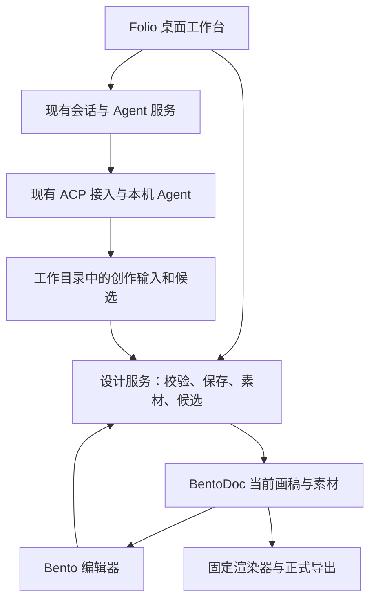

# Folio 平面设计平台改造清单

Status: proposed
Translation: pending

## 摘要

Folio 当前沿用 Lody 的 coding-agent 工作台，具备桌面外壳、会话、Agent 接入和本地持久化，但缺少以可编辑画稿为中心的产品流程。本提案保留这些基础设施及现有 UI 设计语言，从相邻 agentic-listing-design 项目迁入 Bento 文档、编辑、素材与导出能力，将产品转为本地优先的平面设计工作台。整体方向已获基本认可，本次细化为从技术切片到发布验收的七个阶段，避免两套会话和调度系统并存。具体行为以新增 Spec 草案待复核，Agent 由用户选择，发布平台支持仍待实机证据；已完成 P0 macOS 固定样稿集成与本地安装产物验收，完整产品流程尚未实现。

## 调研范围与依据

- Folio 基线：`8ea564d`；相邻项目基线：`7fd3c06`。检查了本地文档、关键源码和仓库已有截图，没有启动应用或调用真实模型。
- 本项目架构入口：[README](../../../../README.md)、[Electron](../../../../apps/electron/README.md)、[平台边界](../../../../packages/platform/AGENTS.md)、[共享合同](../../../../packages/shared/AGENTS.md)。README 包含完整 Lody 产品描述，不能视为本地 OSS 构建实际开放的功能清单。
- 本项目 UI 入口：[会话外壳](../../../../packages/components/src/components/sessions/session-detail.tsx)、[侧面板](../../../../packages/components/src/components/sessions/session-side-panel-tab-bar.tsx)、[设置目录](../../../../packages/components/src/components/settings/settings-tabs.tsx)、[主题](../../../../packages/components/src/tailwind/index.css)。设置已经按平台能力隐藏云账户、计费等入口。
- 本地同步参考：[Loro 数据面](../../../docs/cli-lib-local-loro-data-plane.md)。本地持久化不等于已经实现作品实时多人编辑。
- 相邻项目位于 `/Users/macmini/dev/agentic-listing-design`。主要依据为 `CONTEXT.md`、`docs/solution.md` §3、`docs/local-agent-cli-design.md`、`docs/local-agent-cli-progress.md`、`docs/f18-1-acceptance.md`。
- 迁移源码依据：相邻项目 `packages/contracts/src/revision.ts`、`packages/kernel/src/kernel.ts`、`packages/authoring/src/revisions.ts`、`packages/orchestration/src/{job-context,revisions,orchestrator}.ts`、`packages/editor-bento/src/bridge.ts`、相邻项目的 `editor-bridge.js` 父桥接源码、`packages/editor-bento/scripts/production-render.mjs`。
- 查阅两边已有 UI 图片：本项目 README hero 只作布局参考；相邻项目 `docs/assets/f18-ui/01-workbench.png` 为既有工作台截图，不代表本轮运行结果。

## 重要发现

1. 相邻项目 README 仍描述 Docker 与旧运行路径；当前桌面方案和实现已转向用户安装的多种 Agent CLI。不能迁入旧沙箱、旧 egress 或应用自带 Agent 作为新产品前置条件。
2. 相邻项目的设计产物是单画布静态设计。PPTD 是 Agent 创作输入，BentoDoc 是唯一长期可编辑文档；不支持多页演示文稿，也不能从格式名称推断 PPTX 互操作。
3. 它已有参考图、结构化编辑、元素选区、素材、修订、冲突候选、PNG/JPEG 导出路径。源码中的 `commitEditor` 检查预期当前修订；`commitEditCandidate` 对基线、当前稿和候选做协调，冲突不覆盖当前稿。
4. 相邻项目进度记录明确区分 Pi/Codex 真实设计流程与其他 CLI 的部分证据，旧 UI/UX 曾被判不通过，F18 重做仍待人工评价。迁移不能继承“所有 Agent 已通过”或“UI 已验收”的结论。
5. 既有 Bento 截图仍出现 New slide、Slideshow、媒体等控件，与单画布目标不一致。迁入渲染能力不能等同于直接采用整套编辑器界面。
6. 本项目侧面板类型直接列举 files、changes、pr、browser、session、file、diff，接入设计需修改面板选择、恢复和状态处理，不能只替换图标和文案。
7. 导出依赖固定编辑器壳、字体与 Chromium；生产入口目前还引用相邻项目 verify 中的共享构建/浏览器辅助代码。迁移要带齐实际生产依赖并整理归属，不能只复制一个 render 文件或用窗口截图代替正式导出。

## 建议产品范围

定位：用自然语言、参考图和手工编辑完成可交付平面设计的本地桌面工作台。

首期覆盖海报、社交配图、封面、横幅、信息图、长图及通用电商图片。Amazon A+ 等场景只作为可选技能或尺寸预设，不进入设计内核。首期每个作品一个画布；项目可组织多个作品，但不在首期增加一个文档内的多画板模型。

主要流程：新建设计 → 输入用途、尺寸及参考材料 → Agent 生成可编辑作品 → 选中元素对话修改或手工调整 → 比较和采用候选 → 保存及重开 → 导出。

无需选择 Git 仓库或分支才能创作；用户通过会话历史查找设计产出，不提供独立作品目录或目录迁移功能。底层工作目录与画稿、素材的持久化归属仍须核对，不能把历史入口等同于已保存完整产物。

## 功能处置清单

| 功能                                                              | 建议处置           | 目标与边界                                                                   |
| ----------------------------------------------------------------- | ------------------ | ---------------------------------------------------------------------------- |
| Electron 外壳、窗口、快捷键、菜单、通知                           | 保留               | 沿用现有桌面结构和组件体系                                                   |
| 主题、排版、按钮、弹窗、侧栏、标签页                              | 保留并适配         | 以 Folio 当前 UI 为基准；Bento 控件统一主题和密度                            |
| ACP、Agent 选择、模型、权限、流式输出、取消与恢复                 | 保留               | 本项目继续拥有进程和会话生命周期；逐 Agent 验证设计能力                      |
| Loro/Flock 会话持久化和本地通信                                   | 保留               | 不为此次改造重写存储；不自动延伸为画稿协作模型                               |
| 搜索、置顶、重命名、归档、草稿、附件                              | 保留并改造         | 围绕设计会话和作品查找，增加缩略图与作品入口                                 |
| 当前项目/仓库入口                                                 | 改造               | 从设计会话进入创作和查找历史产出，移除必选仓库/分支的心智负担                |
| 侧栏开发状态                                                      | 改造               | 展示生成中、等待回应、候选待处理等；去掉行数差异、PR、Mergeable              |
| 主对话                                                            | 改造               | 保留正文、工具展开、输入体验，增加作品卡、候选对比和选区上下文               |
| 右侧文件/变更面板                                                 | 改造               | 默认画布；素材为辅助面板，文件浏览降级为高级入口                             |
| 引用与视觉批注                                                    | 改造               | 引用参考素材和稳定元素 ID，携带作品身份与当前稿基线；不能只用坐标或截图      |
| Agent Roles                                                       | 保留到高级设置     | 可承载设计指令预设；不强制增加多角色编排，不把品牌素材存入 Role              |
| Skills 与 MCP                                                     | 保留底层、简化入口 | 固定接入 graphic-design，按需启用 imagegen；避免新建插件平台                 |
| Onboarding                                                        | 改造               | 语言/外观、可用 Agent、图像服务状态、首个设计；取消代码仓库任务导览          |
| 设置                                                              | 改造               | 通用、外观、快捷键、Agents、图像连接、设计资源/保存、关于；MCP/Role 放高级项 |
| token/上下文与耗时                                                | 保留必要信息       | 图像调用与费用仅展示可观测数据；未知不显示零费用                             |
| Git diff、提交、分支、worktree、合并                              | 从设计主流程移除   | 历史还原留待未来基于 Git 单独设计；后台依赖按调用链逐步删除                  |
| GitHub、PR、CI、自动代码审查/自动归档                             | 从设计产品移除     | 检查入口、后台订阅和任务注册，不能只隐藏按钮                                 |
| 通用终端、IDE 打开、端口/网页应用预览                             | 降级或退出首期     | CLI 安装诊断可使用外部终端；网页参考浏览按实际需求保留                       |
| 聊天分叉、子标签、侧聊、多 Agent 调度                             | 降级               | 先保证主设计会话；作品复制/候选不能直接等同聊天 fork                         |
| 远程机器、云账户、计费、团队邀请、Web/mobile                      | 不纳入首期         | 遵循本地 OSS 能力边界；共享包残留不在首轮机械全删                            |
| Lody 品牌、代码示例、帮助文案                                     | 改造               | 对外名称暂按 Folio；包名和内部协议名不做无关全局替换                         |
| Bento 画布与属性编辑                                              | 迁入并整理 UI      | 文字、图片、形状、布局及已支持静态元素；移除演示/视频等非目标入口            |
| 素材库                                                            | 迁入最小版         | 上传、预览、插入、替换、重新生成；区分参考素材与作品实际使用素材             |
| 设计候选                                                          | 迁入必要能力       | 显式采用/拒绝、并发人工修改保护；不迁入历史版本或恢复                        |
| 正式导出                                                          | 迁入               | PNG/JPEG、透明背景行为和实际像素尺寸明确；从已保存当前稿生成                 |
| 品牌资源与尺寸预设                                                | 分期新增           | 首期项目参考文件、色彩/字体偏好、常用尺寸足够；不先建品牌管理系统            |
| 模板市场、多人实时协作、批量尺寸变体、PDF/SVG/PSD/PPTX、视频/动效 | 延后               | 分别确认需求与编辑/导出能力后再立项                                          |

“移除”是拟定产品范围，不授权本轮删除代码。实际删除须确认后台消费者和旧数据；历史设计、聊天和用户目录不得因改版被清空。

## UI 建议

沿用当前侧栏、对话和侧面板结构，不重建另一套首页或桌面壳。默认工作区为左侧项目/设计会话，中间对话，右侧较大画布；允许收起对话进入专注画布模式。窄窗口切换对话与画布，保留同一编辑器实例和未保存状态。

画布顶部放作品名、尺寸、保存状态和导出；选择元素后显示属性。素材和图层按需展开，避免同时固定项目侧栏、对话、图层、画布、属性五个面板。新建设计可以从一句话、参考图或尺寸预设开始，不先显示庞大模板库。

对话中的操作需要产品化：“重新生成方案”“替换这张图”“修改整体风格”提供上下文动作，无需记忆相邻项目的斜杠命令。保留命令作为高级快捷方式即可。

## 架构与数据归属建议

- **一个运行时负责人**：由 `apps/cli` 继续管理 Agent 与会话；不并入相邻项目完整 Runtime Manager、session store 或 HTTP/SSE 应用服务器。
- **一个画稿提交负责人**：本地设计服务拥有 canonical、素材和当前画稿保存。建议由现有 CLI 后台承载，Electron 负责编辑器资源、受控桥接、原生文件交互和渲染进程；具体接口在首个切片验证。
- **分开存储不同事实**：Loro/Flock 继续存会话和关联元数据；复用会话 workspace 保存当前画稿与素材，不迁入不可变修订库。两者通过稳定 ID 关联，不将完整 BentoDoc 同时作为第二份可写聊天状态。
- **作品与会话分开命名**：项目组织作品；作品具有可定位身份及当前状态，不维护历史画稿快照；首期默认一个作品对应一个主设计会话。会话/回合记录相关作品及输入基线，会话归档和删除沿用原项目行为，不新增删除普通 workspace 文件的操作。侧栏现有 Session 不直接重命名成另一种 Task 数据实体。
- **版本与执行分开**：Agent 回合完成不代表产物有效；校验和画稿保存完成后才展示可用作品。缺失产物、失败、取消与成功必须区分。
- **人工编辑不能丢**：派发前确认保存并固定当前稿基线、选区、参考和技能；Agent 产物先收集校验，再按基线协调。可证明不冲突时应用，冲突或重生成时保留独立候选，由用户处理；不因出现文件而停止 Agent。
- **通信复用既有边界**：设计操作接现有受控后台接口，明确对象身份、schema 和失效条件。MCP 可承载 Agent 侧设计工具，但不与现有 MCP/Role 目录另建一套持久化或默认选择机制。
- **跨平台与编辑器依赖**：保留固定构建资源和导出依赖，核对 Bento 子模块、patches、字体、图标、Chromium 及相关来源声明；不能只把它当作普通 npm React 组件。

## 迁移与实施顺序

2026-09-09 更新：整体方向已获基本认可，当前请求只授权实施规划。本节取代此前五步概要；仍为 proposed，不把方向性认可当作新 Spec 已逐项批准。产品意图单独记录在 [Spec 草案](../../../../specs/graphic-design-platform.zh.md)。已有 UI 概念图作为实施参考，不作为控件能力或交互验收依据。

### 阶段总览

| 阶段              | 交付结果                                      | 依赖                   | 完成后能做什么                            |
| ----------------- | --------------------------------------------- | ---------------------- | ----------------------------------------- |
| P0 技术切片与合同 | 在当前桌面构建中证明 Bento 可加载、渲染和交付 | 无                     | 固定样稿在 Folio 中打开和导出             |
| P1 作品与手工编辑 | 会话 workspace、当前画稿和编辑器接入          | P0                     | 无 Agent 也能新建、编辑、保存、重开和导出 |
| P2 Agent 设计闭环 | 现有 Agent + 设计技能 + 参考图 + 候选提交     | P1                     | 用自然语言完成第一张可编辑设计            |
| P3 持续创作       | 选区修改、素材库与候选比较                    | P2                     | 多轮迭代、人工/Agent 协同和恢复           |
| P4 工作台产品化   | 导航、画布、输入、设置和引导统一              | P3；局部界面整理可提前 | 设计师无需了解内部工具即可创作            |
| P5 开发功能清理   | 清理开发链路与品牌文档                        | P4                     | 得到聚焦设计的应用                        |
| P6 发布验收       | 安装包、Agent/平台支持矩阵及完整旅程证据      | P5                     | 可交付的首版，而非只在开发机跑通          |

P0–P2 是第一个可演示闭环，P3–P4 构成可日常使用的测试版，P5–P6 完成首版交付。每阶段都有可运行结果；下阶段依赖项未通过时先解决具体问题，不把失败归入后续“优化”。不按猜测给固定工期；P0 完成后依据真实迁移成本拆分工作量。

### P0：验证编辑器接入和确定最小合同

阶段边界已确定：固定合成样稿在开发版与打包版中打开、重开和导出，并验证最小持久化链路；完整新建、编辑保存属于 P1，Agent 生成属于 P2。macOS 实机开发版及安装包验收阻塞进入 P1；Windows/Linux 同期执行构建与资源探针，发布支持须另有实机证据。

**工作项**

- P0.1 校准仓库要求的 Node/pnpm 与原有构建基线，记录既有失败，避免误把环境问题归因于迁移。
- P0.2 固定相邻代码版本，列出 contracts → kernel/authoring → quality/render/editor 的真实依赖，包括 capability matrix、Bento 子模块、patches、字体、图标及生产渲染辅助文件；保留必要来源声明。
- P0.3 在现有 Electron 开发与打包路径加载固定样稿，验证编辑器资源、受控通信与 PNG/JPEG 渲染；不移植相邻项目的完整 Web 应用、HTTP/SSE 后台或 Runtime Manager。
- P0.4 明确产物定位、会话关联、当前稿基线、素材和候选的 workspace 存储归属，确认设计服务由 CLI 后台承载、渲染由 Electron 服务承载的接口。写明提交成功但通知/会话关联更新失败后的恢复路径。
- P0.5 确定独立应用标识/数据目录；核对会话使用的非 Git 工作目录派发链，不新增用户管理作品目录的入口。记录可用于后续验收的现有 Agent 接入和拟发布平台；Agent 由用户选择，不绑定 Pi 或其他特定 Agent，P0 不依赖真实生成流程。

**模块**：`apps/electron` 的资源、IPC 与渲染服务；`apps/cli` 的本地项目/会话入口；`packages/shared` 的窄协议；拟迁入设计包。共享类型保持平台中立，不把 Node 文件操作塞入 UI 包。

**验收**：在当前应用构建内打开一张包含文字、透明图片和形状的合成样稿，生成与画布尺寸一致的 PNG/JPEG；重开一致；开发和打包资源不依赖隔壁绝对路径。后续 CI 能重现生产资源构建。构建工具或格式兼容问题必须在此解决，不能静默改换渲染器。

### P1：打通作品存储与手工编辑

**工作项**

- P1.1 新建设计项目、空白单画布作品、名称和尺寸；复用现有项目/会话入口，补齐独立作品关联。没有 Git 或 Agent 也能打开作品。
- P1.2 在会话侧面板加入真实画布类型，处理标签恢复、切换和编辑器实例身份；接入文本、图片、形状以及既有支持元素的编辑命令。
- P1.3 保存 canonical 当前画稿与素材，保留预期状态校验以防并发覆盖，不迁入不可变修订库；落盘后再报告保存成功。保存失败和失效消息不可覆盖另一作品。
- P1.4 自动保存、撤销/重做、切换/关闭/退出的保存确认；已保存当前稿的正式 PNG/JPEG 导出和原生保存对话框。
- P1.5 清除画布中不受支持的演示/媒体入口，沿用 Folio 基础主题，先保证最小界面可用。

**模块**：设计文档与持久化包、CLI 设计服务、`session-detail`/侧面板、Electron 导出和资源桥接。

**验收**：无 Agent、无 Git 的目录中创建作品 → 编辑文字和图片 → 撤销/重做 → 切换 → 退出重开 → 导出，画稿与素材不丢；保存失败保留修改并给出真实状态；两个编辑器实例的迟到消息不会串写。版本校验和原子写入随首次保存同时交付，不延后到 P3。

### P2：接通首个 Agent 设计闭环

**工作项**

- P2.1 通过本项目现有接入驱动一个可用 Agent；将 `graphic-design` 和明确选择的 `imagegen` 产品技能放入任务上下文，记录应用提供材料的版本/内容身份，不改写用户全局配置。
- P2.2 准备需求、参考素材和工作目录；发送前保存画布并固定输入基线，沿用现有回合接收、权限请求与取消流程。
- P2.3 Agent 自然完成后采集、校验和提交产物；区分对话结束、生成失败、产物无效和设计完成。复用单一设计提交者。
- P2.4 引入图像服务最小配置和可用性反馈，采用已有凭据存储边界；图像连接失效时仍能编辑和导出已有作品。
- P2.5 提供真实结果卡和画布定位；发生并发修改时至少保存独立候选并给出处理入口，不能先覆盖后在 P3 修复。

**模块**：CLI 会话派发/产物采集、设计技能与上下文组装、现有 MCP/权限链、设计服务及对话结果卡。

**验收**：真实 Agent 完成“参考图 + 需求 → 可编辑作品 → 手工修改 → 保存重开 → PNG/JPEG 导出”；同时验证真实取消、权限回应和无效产物路径。视觉效果由人工判断；合成 Agent 测试只能证明协议。真实 API 调用按届时已有授权和配置执行，本轮不调用。

### P3：补齐多轮设计和恢复能力

**工作项**

- P3.1 将选区的元素 ID、作品和当前稿基线绑定到输入；支持局部修改及明确的整体重新生成，失效选区不自动换目标。
- P3.2 素材库支持上传、预览、插入、替换和重新生成；区分参考与实际引用，删除素材不破坏当前稿和待处理候选。先不做垃圾回收系统。
- P3.3 迁入已有安全的修改协调；完整呈现候选的基线/当前/新稿，支持采用和拒绝，采用时再次校验版本，重复操作幂等。
- P3.4 未决候选和草稿在重开后仍可处理；不实现历史缩略图、历史版本打开或修订恢复。
- P3.5 完善失败/取消后的显式继续、Agent 切换与作品上下文恢复；保持不同 provider 会话引用分离，禁止重启自动重试付费请求。

**模块**：设计服务中的素材/当前稿/候选协调、选区桥接、对话输入、素材面板。

**验收**：Agent 改标题时用户改背景，不冲突的改动保留；双方改同一属性时保留当前稿与候选；比较期间再次手工保存后采用旧比较结果不会覆盖新稿。通过会话历史打开 workspace 最新画稿；缺素材及失败恢复不伪报成功。

### P4：统一为设计工作台

**工作项**

- P4.1 实现现有概念图对应的首页/新建、工作台、素材、版本和设置流程，复用 Folio 的组件、主题、导航与标签页，按真实能力修正示意控件。
- P4.2 侧栏呈现项目与设计会话，使用作品缩略图和生成/待回应状态；调整画布默认宽度、专注模式、窄窗口视图切换和属性面板。
- P4.3 将重新生成、替换图片、调整风格做成上下文动作；保留草稿、附件、引用、工具折叠、流式滚动及输入法行为。
- P4.4 整理 Agents/图像连接/保存等设置，Role/MCP 放高级项；改造首个设计引导。提供最小尺寸预设及项目参考资料，不新建模板市场。
- P4.5 此阶段完成 Git/PR 等开发入口的退出，并关闭它们在设计会话中的无用后台活动；物理代码删除在 P5 按消费者审查。

**模块**：`packages/components` 的导航、会话、设置、onboarding、i18n 与主题，以及 Bento 编辑器的可见控件。

**验收**：首页 → 创作 → 素材 → 修改 → 历史 → 导出的交互连续；键盘、中文输入法、弹窗焦点、深浅主题和窄窗口可用。由人工实际操作评价设计体验，不能只凭截图通过。新呈现组件和关键状态按仓库规则补 Storybook。

### P5：清理开发功能

**工作项**

- P5.1 按“入口 → hook/订阅 → 后台任务 → 依赖包”清理 Git/PR/CI/代码审查等仅开发用途的链路；保留被设计运行时使用的文件、进程、权限和恢复能力。
- P5.2 简化或降级终端、IDE、网页开发预览和复杂会话编排；不为删除文件数量重写 Loro 或底层协议，不做无关全仓库改名。
- P5.3 已取消：不迁入隔壁作品目录导入功能；旧程序数据保持原状。
- P5.4 更新 Folio 名称、图标/说明、帮助、新手示例和公开 README；更新依赖锁文件、第三方声明和受影响模块规则。

**模块**：CLI 开发工具链、components 的开发面板和路由、Electron 应用身份、依赖与文档。

**验收**：设计项目无需 Git/GitHub 可完成主流程，无残留开发后台任务；不带旧开发工具的新安装仍正常。不提供作品目录导入；旧程序数据不受清理影响。边界检查证明未引入相邻项目 Web/mobile 或私有运行依赖。

### P6：安装包与首版验收

**工作项**

- P6.1 在每个拟发布 OS/架构测试实际安装包，核对独立身份、数据目录、编辑器/字体/Chromium 资源、原生依赖和导出。Mac 优先真实设计验收；Windows/Linux 的构建探针从 P0 起覆盖，最终缺失证据的平台不标已支持。
- P6.2 为保留的 Agent 列出发现、图片输入、技能、交互、取消、继续及完整设计流程证据；至少另一种真实 Agent 验证接入通路，不能让首个 Agent 通过代表所有接入通过。Pi 与其他 coding agent 一样由用户选择，按实际接入能力验证，不作为项目绑定依赖。
- P6.3 固定合成海报、信息图、长图三类样例，测量加载/编辑/保存/导出及内存表现，依据实测与目标机器确定可接受范围，不预先发明性能指标。
- P6.4 验证普通用户安装、无 CLI 状态、图像服务错误、退出重开、磁盘写入失败、候选恢复；补用户文档及发布说明。

**验收**：安装包内走完完整旅程，自动检查与人工视觉/编辑体验分别记录；每个宣称支持的平台和 Agent 均有对应证据。首发不要求应用自动安装外部 Agent，也不新增自动更新系统。打包通过不等于签名/发布完成，实际发布单独执行。

### 执行纪律、检查与拆分

- 依赖顺序为 P0 → P1 → P2 → P3 → P4 → P5 → P6；资源打包探针、现有 UI 适配与文档随所属能力同时完成，不全部拖到最后。这里没有创建执行任务或委派 Agent。
- 每个 Pn.x 是可拆分工作包，具体 PR 大小由真实差异决定。先按运行链交付完整切片，避免连续多批只落空接口的 PR；社区贡献仍遵循现有尺寸/指派规则。
- 每个改动做一次最贴近风险的检查：纯校验/协调用确定性测试，跨模块生命周期用集成检查，保存/退出/导出用实际桌面旅程。迁入已有有效测试，不建立重复测试框架。
- 关键保护：版本不覆盖、失败不丢稿、错误实例消息不串写、导出绑定已保存当前稿、重启不自动模型调用。并发测试使用显式信号和可控顺序，不使用真实 sleep 或网络作为 CI 正确性条件。
- 提交前依仓库执行 `pnpm check` 和 `pnpm format`；包范围/组合变化执行 `pnpm check:public-boundary`，原生/资源变更执行目标平台打包探针。阶段完成记录实际运行结果及跳过项。
- 各阶段同步维护此 owning note、Spec 草案和受影响 README/规则；不把计划勾选当成实现证据，不自动将 Spec 改为 approved。
- 回退以旧程序数据不变、当前稿安全保存和独立应用目录为基础。不允许旧版本强行写入不认识的新格式；不增加双写旧/新画稿的“兼容层”。

不迁入相邻项目的作品目录导入功能，也不迁移聊天、provider 句柄或失败任务。用户通过会话历史查找 Folio 产出。新应用的数据目录和应用标识需与 Lody 及隔壁程序隔离。

## 待确认的决定

整体方向已获基本认可；单人单画布、Folio UI 与 Bento 作为本计划的工作基线。P0 切片边界、平台门槛、最新画稿语义、沿用会话删除行为及 Agent 不绑定已确定；具体发布平台仍以实机证据为准。下表保留范围与取舍，后续只处理影响实施的实际差异。

### 预期 UI 效果图

2026-09-09 补充了[五张 UI 概念图与提示词](../../../../output/imagegen/folio-ui-v1/README.md)，覆盖首页、对话画布、素材库、版本对比及设置。通过内置 imagegen 生成，以同一工作台图作为其他页面的视觉参考；合成案例与 Agent 状态只用于界面示意。已检查主要布局和页面覆盖，没有进行交互实现或验收，方案仍为 proposed。

| 决定         | 建议默认                                                       | 改变选择的影响                                         |
| ------------ | -------------------------------------------------------------- | ------------------------------------------------------ |
| 首期范围     | 本地单人、单作品单画布、通用平面设计                           | 多画板/演示/云协作会扩大文档、权限、同步及导出范围     |
| 编辑器与布局 | 保留 Folio UI，迁入 Bento 能力，对话与大画布并排               | 换编辑器将重新验证文档、编辑、保存和导出，不是简单换皮 |
| Agent 范围   | 由用户选择已有接入，先验收一个完整流程，不绑定 Pi 或其他 Agent | 每个接入按真实能力验证，不能由一个通过推断全部支持     |
| 旧数据       | 不迁入作品目录导入功能，原数据保留                             | 若未来需要迁移，另行定义范围与格式                     |

## 验证与局限

首次调研仅新增此提案，无产品代码、依赖清单或现有 Spec 改动。未运行构建、产品测试或真实模型，也未确认视觉质量、性能和跨平台集成可行性；相邻项目既有验收只作来源证据。

后续规划轮补充：本次更新了分阶段计划并新增 `specs/graphic-design-platform.zh.md` 草案，保留已有 UI 概念图及其引用，未改产品代码或依赖。新计划尚未执行；`node scripts/docs/main.mjs check` 通过，无错误，仍有 18 条既有大小警告，无注册 SHA topic。两份设计文档均待英文翻译，未标注实现或 Spec 批准。

开工时系统 `pnpm` 实际解析为 11.19.0，与仓库要求的 10.20.0 不符，并在执行 docs 命令时启动安装；已停止该进程，改用同一脚本 `node scripts/docs/main.mjs status`，结果无错误且无已注册 SHA topic。工作树检查未见依赖文件变化。完成时 `node scripts/docs/main.mjs check` 通过，无错误，有 18 条既有 AGENTS.md 大小警告；英文翻译保持 pending，不表示方案已批准。

2026-09-09 P0 范围细化：固定样稿切片与平台门槛已确定；取消此前作品目录及复制导入建议，历史产出通过会话历史查找。此取舍减少目录管理和迁移流程，不取消画稿与素材持久化要求；历史只作为会话查找入口，画稿只保留 workspace 最新状态；归档和删除沿用原项目语义。已同步 Spec 草案和术语表；未实施产品代码或运行验收。

2026-09-09 历史语义修正：会话历史不是设计版本历史。首期只保存 workspace 最新画稿，取消不可变修订库、历史版本入口和恢复流程；未来历史还原基于 Git 另行设计。并发状态校验和待处理候选不等于历史版本功能。会话删除沿用原项目行为，不新增本地 workspace 文件删除；既有 Git worktree 清理例外保持原有语义。此前 UI 概念图中的版本页面不再属于实施范围。

删除路径源码核对：[`getDefaultSessionWorkdir`](../../../../apps/cli/src/session/session.ts) 使用应用数据根下的 `chats/<sessionId>`；[`deleteSession` 路径](../../../../apps/cli/src/lib/message-handler.ts) 删除持久会话文档并释放运行资源，只对可识别 Git worktree 执行目录清理，不删除普通工作区。因此永久删除并非单纯 UI 隐藏，但保留普通工作文件。此结论来自只读源码检查，未运行删除测试。

## P0 实施记录（2026-09-09）

已获完整 P0 实施授权；仍不把阶段实现视为整个产品 Spec 获批。当前迁入源码闭包及固定样稿，不实现 P1 编辑、P2 Agent 生成、作品目录管理或版本库。实现入口与来源说明见 [Bento 包](../../../../packages/design-bento/README.md)。

- 环境使用 Node 22.22.0、corepack pnpm 10.20.0；初始化仓库固定 ACP 子模块。系统另有 pnpm 11，验证时用临时 corepack shim 保证嵌套脚本同样走 10.20.0，没有改用户全局工具。
- 相邻源码固定在 `7fd3c0691876ec7428fe3f3ef1ef6c4c46cdef12`，Bento 子模块固定在 `813c71fff72491e6898f5e55a20da44a562be586`。来源清单校验拷贝源码与补丁哈希，保留 capability matrix、离线图标和字体声明。真实构建闭包为 Bento slides/kernel + contracts + adapter kernel/editor；PPTD authoring、quality 编排与历史修订存储不进入固定样稿切片。
- CLI 独立构建入口 `design-sample.js` 只接收严格校验的 `open-sample` 请求，拥有 `<Folio data root>/chats/folio-p0/design.json`。整份样稿和素材原子发布，重复打开不会覆盖已有文件；损坏或不同内容明确报错。响应丢失后再次打开读取已落盘内容。此合成样稿不新增 Session 元数据，真实 Session 关联属于 P1。
- Electron 原生 File 菜单打开样稿并导出，使用无 preload/Node 权限的独立 session；仅提供固定文档和编辑器资源，拒绝其他路径、写请求、权限、弹窗及外网。Bento 投影出的 stage 为展示与导出唯一来源；导出不包含窗口界面。
- Electron 精确固定为 39.5.1（Chromium 142.0.7444.265）；这是 Folio 实际生产渲染宿主，未迁入隔壁的独立 Chrome for Testing/Playwright 后台。改变宿主后的结果重新验收，不继承隔壁渲染结论。macOS arm64 开发构建与打包后 `.app` 均实际通过固定样稿重开字节一致、800×600 输出、PNG 透明角和 JPEG 白色角检查；已查看实际导出图。证据见 [开发记录](../../../../output/folio-p0/development.json)、[打包运行记录](../../../../output/folio-p0/packaged.json)、[PNG](../../../../output/folio-p0/sample.png)。
- Folio 的 profile 使用 `.folio`、`folio` scheme、`dev.folio.app` 及独立本地 host 端口 17790；TS/CJS、桌面打包和相关路径测试同步。普通 workspace 删除语义未改，Lody 数据不迁移或删除。
- Windows/Linux/macOS 的资源构建矩阵已加入 CI，使用相同源清单及资源检查脚本。本机 macOS arm64 和三平台远端 CI 均已通过；Windows/Linux 只验证资源构建与完整性，不扩大应用运行支持平台。

### 当前验证限制

本机空间一度耗尽，首次完整检查在 CLI 测试阶段出现 ENOSPC，已中止；仅清理本轮下载缓存，保留用户数据与安装依赖。另有两项既有 Claude 认证测试受 shell 的 Anthropic 配置影响，隔离配置后 31 项认证测试通过。应用包已生成并可执行 P0 探针，但打包命令的 ad-hoc codesign 在 Electron Framework 报 `internal error in Code Signing subsystem`，尚无成功签名/安装器结论；不是已发布版本。完整 `pnpm check` 在隔离 Anthropic shell 配置后复跑通过：CLI 2615 项通过、4 项跳过，UI 3275 项通过，Electron 100 项通过；共享包、脚本、类型检查、lint、i18n 和边界检查均通过。`pnpm format` 已执行，移除了无关格式差异。末次保存同步及图片解码就绪细化另做定向测试和类型检查；文档检查通过。

### P0 安装产物补充验收（2026-09-09）

用户清理磁盘后，ad-hoc 签名重试成功。随后通过既有 `package-electron.mjs` 包装器重新构建 macOS arm64 DMG，命令退出 0，内嵌 CLI 启动及原生依赖探针通过。`hdiutil verify` 确认镜像校验有效；只读挂载后将应用复制到隔离目录，严格递归签名检查通过，再从该副本启动 P0 探针：重开一致、800×600、PNG 透明与 JPEG 白底均通过。挂载已卸载，未覆盖用户已有应用或数据。见[安装产物证据](../../../../output/folio-p0/installed.json)。此结果取代上文签名失败及安装器未验证的当前结论；仍为本地 ad-hoc 签名，未做 Developer ID 签名、公证或发布。

Windows/Linux/macOS 资源构建及完整性探针已全部通过，[CI 运行](https://github.com/LeonEthan/Folio/actions/runs/34350883149)对应提交 `e64edec462a732003966bea2b1795224d4a4c124`。用户已确认向公开仓库上传资源验证分支；只提交资源闭包、工作流和验证记录，未发布应用或提交工作区全部实现。首次 Windows 构建发现 TEMP 的 8.3 路径与完整路径混用导致 Vite HTML 代理模块失配；构建器对临时目录执行 `realpathSync.native`，重跑三平台均通过。本机重建资源哈希未变，原 macOS 安装产物证据仍对应相同资源。见[CI 证据](../../../../output/folio-p0/ci.json)和[路径修复记录](../../implemented/testing/2026-09-09-bento-resource-ci.md)。

P0 固定样稿、macOS 安装产物门槛及同期三平台资源 CI 已完成。Windows/Linux 应用运行、Developer ID 签名、公证和发布属于后续平台交付验证；不把资源 CI 通过解释为已支持这些平台的完整产品旅程。整份产品提案仍为 proposed，Spec 仍为 draft。
