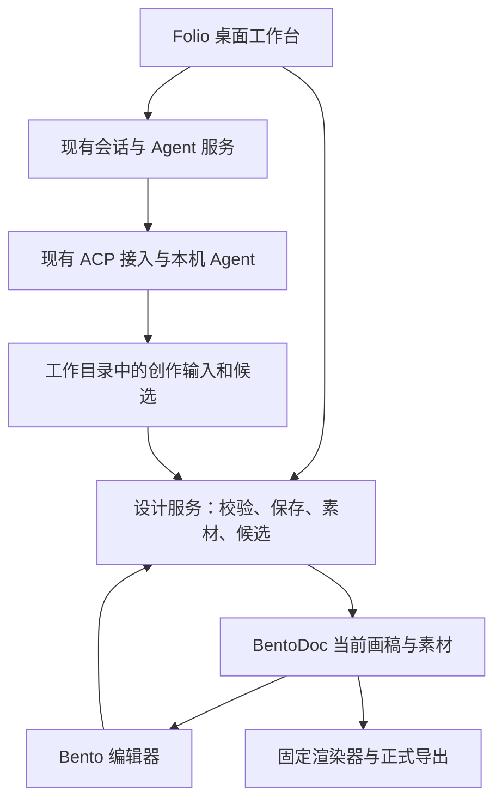

# Folio 平面设计平台改造清单

Status: proposed
Translation: pending

## 摘要

Folio 沿用 Lody 的 coding-agent 工作台，复用桌面外壳、会话、Agent 接入和本地持久化。本提案保留这些基础设施及现有 UI 设计语言，从相邻 agentic-listing-design 项目迁入 Bento 文档、编辑、素材与导出能力，将产品转为本地优先的平面设计工作台。整体方向已获基本认可，本次细化为从技术切片到发布验收的七个阶段，避免两套会话和调度系统并存。具体行为以新增 Spec 草案待复核，Agent 由用户选择，发布平台支持仍待实机证据；已完成 P0 macOS 固定样稿集成与本地安装产物验收，以及 P1 手工编辑闭环。P2 及后续完整产品流程尚未实现。

## 调研范围与依据

- Folio 基线：`8ea564d`；相邻项目基线：`7fd3c06`。检查了本地文档、关键源码和仓库已有截图，没有启动应用或调用真实模型。
- 本项目架构入口：[README](../../../../README.md)、[Electron](../../../../apps/electron/README.md)、[平台边界](../../../../packages/platform/AGENTS.md)、[共享合同](../../../../packages/shared/AGENTS.md)。README 包含完整 Lody 产品描述，不能视为本地 OSS 构建实际开放的功能清单。
- 本项目 UI 入口：[会话外壳](../../../../packages/components/src/components/sessions/session-detail.tsx)、[侧面板](../../../../packages/components/src/components/sessions/session-side-panel-tab-bar.tsx)、[设置目录](../../../../packages/components/src/components/settings/settings-tabs.tsx)、[主题](../../../../packages/components/src/tailwind/index.css)。设置已经按平台能力隐藏云账户、计费等入口。
- 本地同步参考：[Loro 数据面](../../../docs/cli-lib-local-loro-data-plane.md)。本地持久化不等于已经实现作品实时多人编辑。
- 相邻项目位于 `/Users/macmini/dev/agentic-listing-design`。主要依据为 `CONTEXT.md`、`docs/solution.md` §3、`docs/local-agent-cli-design.md`、`docs/local-agent-cli-progress.md`、`docs/f18-1-acceptance.md`。
- 迁移源码依据：相邻项目 `packages/contracts/src/revision.ts`、`packages/kernel/src/kernel.ts`、`packages/authoring/src/revisions.ts`、`packages/orchestration/src/{job-context,revisions,orchestrator}.ts`、`packages/editor-bento/src/bridge.ts`、相邻项目的 `editor-bridge.js` 父桥接源码、`packages/editor-bento/scripts/production-render.mjs`。
- 查阅两边已有 UI 图片：本项目 README hero 只作布局参考；相邻项目 `docs/assets/f18-ui/01-workbench.png` 为既有工作台截图，不代表本轮运行结果。

## 重要发现

1. 相邻项目 README 仍描述 Docker 与旧运行路径；当前桌面方案和实现已转向用户安装的多种 Agent CLI。不能迁入旧沙箱、旧 egress 或应用自带 Agent 作为新产品前置条件。
2. 相邻项目的设计产物是单画布静态设计。PPTD 是 Agent 创作输入，BentoDoc 是唯一长期可编辑文档；不支持多页演示文稿，也不能从格式名称推断 PPTX 互操作。
3. 它已有参考图、结构化编辑、元素选区、素材、修订、冲突候选、PNG/JPEG 导出路径。源码中的 `commitEditor` 检查预期当前修订；`commitEditCandidate` 对基线、当前稿和候选做协调，冲突不覆盖当前稿。
4. 相邻项目进度记录明确区分 Pi/Codex 真实设计流程与其他 CLI 的部分证据，旧 UI/UX 曾被判不通过，F18 重做仍待人工评价。迁移不能继承“所有 Agent 已通过”或“UI 已验收”的结论。
5. 既有 Bento 截图仍出现 New slide、Slideshow、媒体等控件，与单画布目标不一致。迁入渲染能力不能等同于直接采用整套编辑器界面。
6. 本项目侧面板类型直接列举 files、changes、pr、browser、session、file、diff，接入设计需修改面板选择、恢复和状态处理，不能只替换图标和文案。
7. 导出依赖固定编辑器壳、字体与 Chromium；生产入口目前还引用相邻项目 verify 中的共享构建/浏览器辅助代码。迁移要带齐实际生产依赖并整理归属，不能只复制一个 render 文件或用窗口截图代替正式导出。

## 建议产品范围

定位：用自然语言、参考图和手工编辑完成可交付平面设计的本地桌面工作台。

首期覆盖海报、社交配图、封面、横幅、信息图、长图及通用电商图片。Amazon A+ 等场景只作为可选技能或尺寸预设，不进入设计内核。首期每个作品一个画布；项目可组织多个作品，但不在首期增加一个文档内的多画板模型。

主要流程：新建设计 → 输入用途、尺寸及参考材料 → Agent 生成可编辑作品 → 选中元素对话修改或手工调整 → 比较和采用候选 → 保存及重开 → 导出。

无需选择 Git 仓库或分支才能创作；用户通过会话历史查找设计产出，不提供独立作品目录或目录迁移功能。底层工作目录与画稿、素材的持久化归属仍须核对，不能把历史入口等同于已保存完整产物。

## 功能处置清单

| 功能                                                              | 建议处置           | 目标与边界                                                                   |
| ----------------------------------------------------------------- | ------------------ | ---------------------------------------------------------------------------- |
| Electron 外壳、窗口、快捷键、菜单、通知                           | 保留               | 沿用现有桌面结构和组件体系                                                   |
| 主题、排版、按钮、弹窗、侧栏、标签页                              | 保留并适配         | 以 Folio 当前 UI 为基准；Bento 控件统一主题和密度                            |
| ACP、Agent 选择、模型、权限、流式输出、取消与恢复                 | 保留               | 本项目继续拥有进程和会话生命周期；逐 Agent 验证设计能力                      |
| Loro/Flock 会话持久化和本地通信                                   | 保留               | 不为此次改造重写存储；不自动延伸为画稿协作模型                               |
| 搜索、置顶、重命名、归档、草稿、附件                              | 保留并改造         | 围绕设计会话和作品查找，增加缩略图与作品入口                                 |
| 当前项目/仓库入口                                                 | 改造               | 从设计会话进入创作和查找历史产出，移除必选仓库/分支的心智负担                |
| 侧栏开发状态                                                      | 改造               | 展示生成中、等待回应、候选待处理等；去掉行数差异、PR、Mergeable              |
| 主对话                                                            | 改造               | 保留正文、工具展开、输入体验，增加作品卡、候选对比和选区上下文               |
| 右侧文件/变更面板                                                 | 改造               | 默认画布；素材为辅助面板，文件浏览降级为高级入口                             |
| 引用与视觉批注                                                    | 改造               | 引用参考素材和稳定元素 ID，携带作品身份与当前稿基线；不能只用坐标或截图      |
| Agent Roles                                                       | 保留到高级设置     | 可承载设计指令预设；不强制增加多角色编排，不把品牌素材存入 Role              |
| Skills 与 MCP                                                     | 保留底层、简化入口 | 固定接入 graphic-design，按需启用 imagegen；避免新建插件平台                 |
| Onboarding                                                        | 改造               | 语言/外观、可用 Agent、图像服务状态、首个设计；取消代码仓库任务导览          |
| 设置                                                              | 改造               | 通用、外观、快捷键、Agents、图像连接、设计资源/保存、关于；MCP/Role 放高级项 |
| token/上下文与耗时                                                | 保留必要信息       | 图像调用与费用仅展示可观测数据；未知不显示零费用                             |
| Git diff、提交、分支、worktree、合并                              | 从设计主流程移除   | 历史还原留待未来基于 Git 单独设计；后台依赖按调用链逐步删除                  |
| GitHub、PR、CI、自动代码审查/自动归档                             | 从设计产品移除     | 检查入口、后台订阅和任务注册，不能只隐藏按钮                                 |
| 通用终端、IDE 打开、端口/网页应用预览                             | 降级或退出首期     | CLI 安装诊断可使用外部终端；网页参考浏览按实际需求保留                       |
| 聊天分叉、子标签、侧聊、多 Agent 调度                             | 降级               | 先保证主设计会话；作品复制/候选不能直接等同聊天 fork                         |
| 远程机器、云账户、计费、团队邀请、Web/mobile                      | 不纳入首期         | 遵循本地 OSS 能力边界；共享包残留不在首轮机械全删                            |
| Lody 品牌、代码示例、帮助文案                                     | 改造               | 对外名称暂按 Folio；包名和内部协议名不做无关全局替换                         |
| Bento 画布与属性编辑                                              | 迁入并整理 UI      | 文字、图片、形状、布局及已支持静态元素；移除演示/视频等非目标入口            |
| 素材库                                                            | 迁入最小版         | 上传、预览、插入、替换、重新生成；区分参考素材与作品实际使用素材             |
| 设计候选                                                          | 迁入必要能力       | 显式采用/拒绝、并发人工修改保护；不迁入历史版本或恢复                        |
| 正式导出                                                          | 迁入               | PNG/JPEG、透明背景行为和实际像素尺寸明确；从已保存当前稿生成                 |
| 品牌资源与尺寸预设                                                | 分期新增           | 首期项目参考文件、色彩/字体偏好、常用尺寸足够；不先建品牌管理系统            |
| 模板市场、多人实时协作、批量尺寸变体、PDF/SVG/PSD/PPTX、视频/动效 | 延后               | 分别确认需求与编辑/导出能力后再立项                                          |

“移除”是拟定产品范围，不授权本轮删除代码。实际删除须确认后台消费者和旧数据；历史设计、聊天和用户目录不得因改版被清空。

## UI 建议

沿用当前侧栏、对话和侧面板结构，不重建另一套首页或桌面壳。默认工作区为左侧项目/设计会话，中间对话，右侧较大画布；允许收起对话进入专注画布模式。窄窗口切换对话与画布，保留同一编辑器实例和未保存状态。

画布顶部放作品名、尺寸、保存状态和导出；选择元素后显示属性。素材和图层按需展开，避免同时固定项目侧栏、对话、图层、画布、属性五个面板。新建设计可以从一句话、参考图或尺寸预设开始，不先显示庞大模板库。

对话中的操作需要产品化：“重新生成方案”“替换这张图”“修改整体风格”提供上下文动作，无需记忆相邻项目的斜杠命令。保留命令作为高级快捷方式即可。

## 架构与数据归属建议



- **一个运行时负责人**：由 `apps/cli` 继续管理 Agent 与会话；不并入相邻项目完整 Runtime Manager、session store 或 HTTP/SSE 应用服务器。
- **一个画稿提交负责人**：本地设计服务拥有 canonical、素材和当前画稿保存。建议由现有 CLI 后台承载，Electron 负责编辑器资源、受控桥接、原生文件交互和渲染进程；具体接口在首个切片验证。
- **分开存储不同事实**：Loro/Flock 继续存会话和关联元数据；复用会话 workspace 保存当前画稿与素材，不迁入不可变修订库。两者通过稳定 ID 关联，不将完整 BentoDoc 同时作为第二份可写聊天状态。
- **作品与会话分开命名**：项目组织作品；作品具有可定位身份及当前状态，不维护历史画稿快照；首期默认一个作品对应一个主设计会话。会话/回合记录相关作品及输入基线，会话归档和删除沿用原项目行为，不新增删除普通 workspace 文件的操作。侧栏现有 Session 不直接重命名成另一种 Task 数据实体。
- **版本与执行分开**：Agent 回合完成不代表产物有效；校验和画稿保存完成后才展示可用作品。缺失产物、失败、取消与成功必须区分。
- **人工编辑不能丢**：派发前确认保存并固定当前稿基线、选区、参考和技能；Agent 产物先收集校验，再按基线协调。可证明不冲突时应用，冲突或重生成时保留独立候选，由用户处理；不因出现文件而停止 Agent。
- **通信复用既有边界**：设计操作接现有受控后台接口，明确对象身份、schema 和失效条件。MCP 可承载 Agent 侧设计工具，但不与现有 MCP/Role 目录另建一套持久化或默认选择机制。
- **跨平台与编辑器依赖**：保留固定构建资源和导出依赖，核对 Bento 子模块、patches、字体、图标、Chromium 及相关来源声明；不能只把它当作普通 npm React 组件。

## 迁移与实施顺序

2026-09-09 更新：整体方向已获基本认可，当前请求只授权实施规划。本节取代此前五步概要；仍为 proposed，不把方向性认可当作新 Spec 已逐项批准。产品意图单独记录在 [Spec 草案](../../../../specs/graphic-design-platform.zh.md)。已有 UI 概念图作为实施参考，不作为控件能力或交互验收依据。

### 阶段总览

| 阶段              | 交付结果                                      | 依赖                   | 完成后能做什么                            |
| ----------------- | --------------------------------------------- | ---------------------- | ----------------------------------------- |
| P0 技术切片与合同 | 在当前桌面构建中证明 Bento 可加载、渲染和交付 | 无                     | 固定样稿在 Folio 中打开和导出             |
| P1 作品与手工编辑 | 会话 workspace、当前画稿和编辑器接入          | P0                     | 无 Agent 也能新建、编辑、保存、重开和导出 |
| P2 Agent 设计闭环 | 现有 Agent + 设计技能 + 参考图 + 候选提交     | P1                     | 用自然语言完成第一张可编辑设计            |
| P3 持续创作       | 选区修改、素材库与候选比较                    | P2                     | 多轮迭代、人工/Agent 协同和恢复           |
| P4 工作台产品化   | 导航、画布、输入、设置和引导统一              | P3；局部界面整理可提前 | 设计师无需了解内部工具即可创作            |
| P5 开发功能清理   | 清理开发链路与品牌文档                        | P4                     | 得到聚焦设计的应用                        |
| P6 发布验收       | 安装包、Agent/平台支持矩阵及完整旅程证据      | P5                     | 可交付的首版，而非只在开发机跑通          |

P0–P2 是第一个可演示闭环，P3–P4 构成可日常使用的测试版，P5–P6 完成首版交付。每阶段都有可运行结果；下阶段依赖项未通过时先解决具体问题，不把失败归入后续“优化”。不按猜测给固定工期；P0 完成后依据真实迁移成本拆分工作量。

### P0：验证编辑器接入和确定最小合同

阶段边界已确定：固定合成样稿在开发版与打包版中打开、重开和导出，并验证最小持久化链路；完整新建、编辑保存属于 P1，Agent 生成属于 P2。macOS 实机开发版及安装包验收阻塞进入 P1；Windows/Linux 同期执行构建与资源探针，发布支持须另有实机证据。

**工作项**

- P0.1 校准仓库要求的 Node/pnpm 与原有构建基线，记录既有失败，避免误把环境问题归因于迁移。
- P0.2 固定相邻代码版本，列出 contracts → kernel/authoring → quality/render/editor 的真实依赖，包括 capability matrix、Bento 子模块、patches、字体、图标及生产渲染辅助文件；保留必要来源声明。
- P0.3 在现有 Electron 开发与打包路径加载固定样稿，验证编辑器资源、受控通信与 PNG/JPEG 渲染；不移植相邻项目的完整 Web 应用、HTTP/SSE 后台或 Runtime Manager。
- P0.4 明确产物定位、会话关联、当前稿基线、素材和候选的 workspace 存储归属，确认设计服务由 CLI 后台承载、渲染由 Electron 服务承载的接口。写明提交成功但通知/会话关联更新失败后的恢复路径。
- P0.5 确定独立应用标识/数据目录；核对会话使用的非 Git 工作目录派发链，不新增用户管理作品目录的入口。记录可用于后续验收的现有 Agent 接入和拟发布平台；Agent 由用户选择，不绑定 Pi 或其他特定 Agent，P0 不依赖真实生成流程。

**模块**：`apps/electron` 的资源、IPC 与渲染服务；`apps/cli` 的本地项目/会话入口；`packages/shared` 的窄协议；拟迁入设计包。共享类型保持平台中立，不把 Node 文件操作塞入 UI 包。

**验收**：在当前应用构建内打开一张包含文字、透明图片和形状的合成样稿，生成与画布尺寸一致的 PNG/JPEG；重开一致；开发和打包资源不依赖隔壁绝对路径。后续 CI 能重现生产资源构建。构建工具或格式兼容问题必须在此解决，不能静默改换渲染器。

### P1：打通作品存储与手工编辑

**工作项**

- P1.1 已完成：回车提交复用现有 Session 创建和自动命名，同时关联空白单画布。尺寸位于项目目录同一行最右侧，默认 Auto；自定义才要求宽高。没有 Git 也能创建，手工编辑不依赖 Agent 执行；创建提交沿用现有 Agent 配置要求。
- P1.2 在会话侧面板加入真实画布类型，处理标签恢复、切换和编辑器实例身份；接入文本、图片、形状以及既有支持元素的编辑命令。
- P1.3 保存 canonical 当前画稿与素材，保留预期状态校验以防并发覆盖，不迁入不可变修订库；落盘后再报告保存成功。保存失败和失效消息不可覆盖另一作品。
- P1.4 自动保存、撤销/重做、切换/关闭/退出的保存确认；已保存当前稿的正式 PNG/JPEG 导出和原生保存对话框。
- P1.5 清除画布中不受支持的演示/媒体入口，沿用 Folio 基础主题，先保证最小界面可用。

**模块**：设计文档与持久化包、CLI 设计服务、`session-detail`/侧面板、Electron 导出和资源桥接。

**验收状态**：P1 核心实现及 macOS 验收已完成。通过真实回车创建与自动命名 → 编辑文字和图片 → 撤销/重做 → 切换 → 退出重开 → 原生 PNG/JPEG 导出；文件摘要确认重开未丢稿。保存失败、并发冲突及旧实例隔离由存储测试和打包原生探针覆盖。见文末 computer-use 验收记录。P2 设计生成及后续平台发布仍按各自阶段执行。

**P1 交互决定（2026-09-09）**：最初独立新建入口已被用户修订为回车提交和自动命名，过程见文末入口修订。保存失败时阻止切换、关闭或退出并保留修改，提供重试或明确放弃；这会打断离开动作，但避免静默丢稿。标签仍打开时保留撤销/重做，关闭标签或重启后清空撤销历史，仅恢复已保存当前稿；不新增持久化撤销日志。以上已实现，不表示整份 Spec 已批准。

**P1 保存与尺寸边界（2026-09-09）**：沿用迁入语义编辑器的尺寸调整行为，保持元素几何；若有元素超出新画布则拒绝调整并说明原因，不自动缩放或裁切。并发基线冲突拒绝保存并保留修改，允许另存独立作品或明确放弃后重载，不引入自动合并。意外崩溃或断电只保证恢复最后成功保存的画稿与素材，未确认保存的修改可能丢失；不新增崩溃草稿日志。这些决定优先保护已保存内容并复用编辑能力，代价是缩小画布前需人工调整元素、冲突需人工处理。实现见 [CLI 作品存储](../../../../apps/cli/src/design/store.ts)及 [canvas 控件](../../../../packages/design-bento/vendor/packages/editor-bento/src/ui/canvas.ts)。

**P1 冲突另存归属（2026-09-09）**：另存创建独立作品和空白主设计会话，将当前编辑画稿及必需素材复制到新 workspace，不改变原作品，不复制交流记录或撤销历史。复制素材增加存储占用，但避免新作品依赖原 workspace；空白会话避免把原会话执行记录误认为发生在新作品上。另存失败保留未保存修改，并沿用保存失败时的离开保护，直至保存成功或用户明确放弃。实现与探针已覆盖；文档仍为提案和草案，阶段验收不代表整份产品 Spec 获批。

### P2：接通首个 Agent 设计闭环

**工作项**

- P2.1 通过本项目现有接入驱动一个可用 Agent；将 `graphic-design` 和明确选择的 `imagegen` 产品技能放入任务上下文，记录应用提供材料的版本/内容身份，不改写用户全局配置。
- P2.2 准备需求、参考素材和工作目录；发送前保存画布并固定输入基线，沿用现有回合接收、权限请求与取消流程。
- P2.3 Agent 自然完成后采集、校验和提交产物；区分对话结束、生成失败、产物无效和设计完成。复用单一设计提交者。
- P2.4 引入图像服务最小配置和可用性反馈，采用已有凭据存储边界；图像连接失效时仍能编辑和导出已有作品。
- P2.5 提供真实结果卡和画布定位；发生并发修改时至少保存独立候选并给出处理入口，不能先覆盖后在 P3 修复。

**模块**：CLI 会话派发/产物采集、设计技能与上下文组装、现有 MCP/权限链、设计服务及对话结果卡。

**验收**：真实 Agent 完成“参考图 + 需求 → 可编辑作品 → 手工修改 → 保存重开 → PNG/JPEG 导出”；同时验证真实取消、权限回应和无效产物路径。视觉效果由人工判断；合成 Agent 测试只能证明协议。真实 API 调用按届时已有授权和配置执行，本轮不调用。

### P3：补齐多轮设计和恢复能力

**工作项**

- P3.1 将选区的元素 ID、作品和当前稿基线绑定到输入；支持局部修改及明确的整体重新生成，失效选区不自动换目标。
- P3.2 素材库支持上传、预览、插入、替换和重新生成；区分参考与实际引用，删除素材不破坏当前稿和待处理候选。先不做垃圾回收系统。
- P3.3 迁入已有安全的修改协调；完整呈现候选的基线/当前/新稿，支持采用和拒绝，采用时再次校验版本，重复操作幂等。
- P3.4 未决候选和草稿在重开后仍可处理；不实现历史缩略图、历史版本打开或修订恢复。
- P3.5 完善失败/取消后的显式继续、Agent 切换与作品上下文恢复；保持不同 provider 会话引用分离，禁止重启自动重试付费请求。

**模块**：设计服务中的素材/当前稿/候选协调、选区桥接、对话输入、素材面板。

**验收**：Agent 改标题时用户改背景，不冲突的改动保留；双方改同一属性时保留当前稿与候选；比较期间再次手工保存后采用旧比较结果不会覆盖新稿。通过会话历史打开 workspace 最新画稿；缺素材及失败恢复不伪报成功。

### P4：统一为设计工作台

**工作项**

- P4.1 实现现有概念图对应的首页/新建、工作台、素材、版本和设置流程，复用 Folio 的组件、主题、导航与标签页，按真实能力修正示意控件。
- P4.2 侧栏呈现项目与设计会话，使用作品缩略图和生成/待回应状态；调整画布默认宽度、专注模式、窄窗口视图切换和属性面板。
- P4.3 将重新生成、替换图片、调整风格做成上下文动作；保留草稿、附件、引用、工具折叠、流式滚动及输入法行为。
- P4.4 整理 Agents/图像连接/保存等设置，Role/MCP 放高级项；改造首个设计引导。提供最小尺寸预设及项目参考资料，不新建模板市场。
- P4.5 此阶段完成 Git/PR 等开发入口的退出，并关闭它们在设计会话中的无用后台活动；物理代码删除在 P5 按消费者审查。

**模块**：`packages/components` 的导航、会话、设置、onboarding、i18n 与主题，以及 Bento 编辑器的可见控件。

**验收**：首页 → 创作 → 素材 → 修改 → 历史 → 导出的交互连续；键盘、中文输入法、弹窗焦点、深浅主题和窄窗口可用。由人工实际操作评价设计体验，不能只凭截图通过。新呈现组件和关键状态按仓库规则补 Storybook。

### P5：清理开发功能

**工作项**

- P5.1 按“入口 → hook/订阅 → 后台任务 → 依赖包”清理 Git/PR/CI/代码审查等仅开发用途的链路；保留被设计运行时使用的文件、进程、权限和恢复能力。
- P5.2 简化或降级终端、IDE、网页开发预览和复杂会话编排；不为删除文件数量重写 Loro 或底层协议，不做无关全仓库改名。
- P5.3 已取消：不迁入隔壁作品目录导入功能；旧程序数据保持原状。
- P5.4 更新 Folio 名称、图标/说明、帮助、新手示例和公开 README；更新依赖锁文件、第三方声明和受影响模块规则。

**模块**：CLI 开发工具链、components 的开发面板和路由、Electron 应用身份、依赖与文档。

**验收**：设计项目无需 Git/GitHub 可完成主流程，无残留开发后台任务；不带旧开发工具的新安装仍正常。不提供作品目录导入；旧程序数据不受清理影响。边界检查证明未引入相邻项目 Web/mobile 或私有运行依赖。

### P6：安装包与首版验收

**工作项**

- P6.1 在每个拟发布 OS/架构测试实际安装包，核对独立身份、数据目录、编辑器/字体/Chromium 资源、原生依赖和导出。Mac 优先真实设计验收；Windows/Linux 的构建探针从 P0 起覆盖，最终缺失证据的平台不标已支持。
- P6.2 为保留的 Agent 列出发现、图片输入、技能、交互、取消、继续及完整设计流程证据；至少另一种真实 Agent 验证接入通路，不能让首个 Agent 通过代表所有接入通过。Pi 与其他 coding agent 一样由用户选择，按实际接入能力验证，不作为项目绑定依赖。
- P6.3 固定合成海报、信息图、长图三类样例，测量加载/编辑/保存/导出及内存表现，依据实测与目标机器确定可接受范围，不预先发明性能指标。
- P6.4 验证普通用户安装、无 CLI 状态、图像服务错误、退出重开、磁盘写入失败、候选恢复；补用户文档及发布说明。

**验收**：安装包内走完完整旅程，自动检查与人工视觉/编辑体验分别记录；每个宣称支持的平台和 Agent 均有对应证据。首发不要求应用自动安装外部 Agent，也不新增自动更新系统。打包通过不等于签名/发布完成，实际发布单独执行。

### 执行纪律、检查与拆分

- 依赖顺序为 P0 → P1 → P2 → P3 → P4 → P5 → P6；资源打包探针、现有 UI 适配与文档随所属能力同时完成，不全部拖到最后。这里没有创建执行任务或委派 Agent。
- 每个 Pn.x 是可拆分工作包，具体 PR 大小由真实差异决定。先按运行链交付完整切片，避免连续多批只落空接口的 PR；社区贡献仍遵循现有尺寸/指派规则。
- 每个改动做一次最贴近风险的检查：纯校验/协调用确定性测试，跨模块生命周期用集成检查，保存/退出/导出用实际桌面旅程。迁入已有有效测试，不建立重复测试框架。
- 关键保护：版本不覆盖、失败不丢稿、错误实例消息不串写、导出绑定已保存当前稿、重启不自动模型调用。并发测试使用显式信号和可控顺序，不使用真实 sleep 或网络作为 CI 正确性条件。
- 提交前依仓库执行 `pnpm check` 和 `pnpm format`；包范围/组合变化执行 `pnpm check:public-boundary`，原生/资源变更执行目标平台打包探针。阶段完成记录实际运行结果及跳过项。
- 各阶段同步维护此 owning note、Spec 草案和受影响 README/规则；不把计划勾选当成实现证据，不自动将 Spec 改为 approved。
- 回退以旧程序数据不变、当前稿安全保存和独立应用目录为基础。不允许旧版本强行写入不认识的新格式；不增加双写旧/新画稿的“兼容层”。

不迁入相邻项目的作品目录导入功能，也不迁移聊天、provider 句柄或失败任务。用户通过会话历史查找 Folio 产出。新应用的数据目录和应用标识需与 Lody 及隔壁程序隔离。

## 待确认的决定

整体方向已获基本认可；单人单画布、Folio UI 与 Bento 作为本计划的工作基线。P0 切片边界、平台门槛、最新画稿语义、沿用会话删除行为及 Agent 不绑定已确定；具体发布平台仍以实机证据为准。下表保留范围与取舍，后续只处理影响实施的实际差异。

### 预期 UI 效果图

2026-09-09 补充了[五张 UI 概念图与提示词](../../../../output/imagegen/folio-ui-v1/README.md)，覆盖首页、对话画布、素材库、版本对比及设置。通过内置 imagegen 生成，以同一工作台图作为其他页面的视觉参考；合成案例与 Agent 状态只用于界面示意。已检查主要布局和页面覆盖，没有进行交互实现或验收，方案仍为 proposed。

| 决定         | 建议默认                                                       | 改变选择的影响                                         |
| ------------ | -------------------------------------------------------------- | ------------------------------------------------------ |
| 首期范围     | 本地单人、单作品单画布、通用平面设计                           | 多画板/演示/云协作会扩大文档、权限、同步及导出范围     |
| 编辑器与布局 | 保留 Folio UI，迁入 Bento 能力，对话与大画布并排               | 换编辑器将重新验证文档、编辑、保存和导出，不是简单换皮 |
| Agent 范围   | 由用户选择已有接入，先验收一个完整流程，不绑定 Pi 或其他 Agent | 每个接入按真实能力验证，不能由一个通过推断全部支持     |
| 旧数据       | 不迁入作品目录导入功能，原数据保留                             | 若未来需要迁移，另行定义范围与格式                     |

## 验证与局限

首次调研仅新增此提案，无产品代码、依赖清单或现有 Spec 改动。未运行构建、产品测试或真实模型，也未确认视觉质量、性能和跨平台集成可行性；相邻项目既有验收只作来源证据。

后续规划轮补充：本次更新了分阶段计划并新增 `specs/graphic-design-platform.zh.md` 草案，保留已有 UI 概念图及其引用，未改产品代码或依赖。新计划尚未执行；`node scripts/docs/main.mjs check` 通过，无错误，仍有 18 条既有大小警告，无注册 SHA topic。两份设计文档均待英文翻译，未标注实现或 Spec 批准。

开工时系统 `pnpm` 实际解析为 11.19.0，与仓库要求的 10.20.0 不符，并在执行 docs 命令时启动安装；已停止该进程，改用同一脚本 `node scripts/docs/main.mjs status`，结果无错误且无已注册 SHA topic。工作树检查未见依赖文件变化。完成时 `node scripts/docs/main.mjs check` 通过，无错误，有 18 条既有 AGENTS.md 大小警告；英文翻译保持 pending，不表示方案已批准。

2026-09-09 P0 范围细化：固定样稿切片与平台门槛已确定；取消此前作品目录及复制导入建议，历史产出通过会话历史查找。此取舍减少目录管理和迁移流程，不取消画稿与素材持久化要求；历史只作为会话查找入口，画稿只保留 workspace 最新状态；归档和删除沿用原项目语义。已同步 Spec 草案和术语表；未实施产品代码或运行验收。

2026-09-09 历史语义修正：会话历史不是设计版本历史。首期只保存 workspace 最新画稿，取消不可变修订库、历史版本入口和恢复流程；未来历史还原基于 Git 另行设计。并发状态校验和待处理候选不等于历史版本功能。会话删除沿用原项目行为，不新增本地 workspace 文件删除；既有 Git worktree 清理例外保持原有语义。此前 UI 概念图中的版本页面不再属于实施范围。

删除路径源码核对：[`getDefaultSessionWorkdir`](../../../../apps/cli/src/session/session.ts) 使用应用数据根下的 `chats/<sessionId>`；[`deleteSession` 路径](../../../../apps/cli/src/lib/message-handler.ts) 删除持久会话文档并释放运行资源，只对可识别 Git worktree 执行目录清理，不删除普通工作区。因此永久删除并非单纯 UI 隐藏，但保留普通工作文件。此结论来自只读源码检查，未运行删除测试。

## P0 实施记录（2026-09-09）

已获完整 P0 实施授权；仍不把阶段实现视为整个产品 Spec 获批。当前迁入源码闭包及固定样稿，不实现 P1 编辑、P2 Agent 生成、作品目录管理或版本库。实现入口与来源说明见 [Bento 包](../../../../packages/design-bento/README.md)。

- 环境使用 Node 22.22.0、corepack pnpm 10.20.0；初始化仓库固定 ACP 子模块。系统另有 pnpm 11，验证时用临时 corepack shim 保证嵌套脚本同样走 10.20.0，没有改用户全局工具。
- 相邻源码固定在 `7fd3c0691876ec7428fe3f3ef1ef6c4c46cdef12`，Bento 子模块固定在 `813c71fff72491e6898f5e55a20da44a562be586`。来源清单校验拷贝源码与补丁哈希，保留 capability matrix、离线图标和字体声明。真实构建闭包为 Bento slides/kernel + contracts + adapter kernel/editor；PPTD authoring、quality 编排与历史修订存储不进入固定样稿切片。
- CLI 独立构建入口 `design-sample.js` 只接收严格校验的 `open-sample` 请求，拥有 `<Folio data root>/chats/folio-p0/design.json`。整份样稿和素材原子发布，重复打开不会覆盖已有文件；损坏或不同内容明确报错。响应丢失后再次打开读取已落盘内容。此合成样稿不新增 Session 元数据，真实 Session 关联属于 P1。
- Electron 原生 File 菜单打开样稿并导出，使用无 preload/Node 权限的独立 session；仅提供固定文档和编辑器资源，拒绝其他路径、写请求、权限、弹窗及外网。Bento 投影出的 stage 为展示与导出唯一来源；导出不包含窗口界面。
- Electron 精确固定为 39.5.1（Chromium 142.0.7444.265）；这是 Folio 实际生产渲染宿主，未迁入隔壁的独立 Chrome for Testing/Playwright 后台。改变宿主后的结果重新验收，不继承隔壁渲染结论。macOS arm64 开发构建与打包后 `.app` 均实际通过固定样稿重开字节一致、800×600 输出、PNG 透明角和 JPEG 白色角检查；已查看实际导出图。证据见 [开发记录](../../../../output/folio-p0/development.json)、[打包运行记录](../../../../output/folio-p0/packaged.json)、[PNG](../../../../output/folio-p0/sample.png)。
- Folio 的 profile 使用 `.folio`、`folio` scheme、`dev.folio.app` 及独立本地 host 端口 17790；TS/CJS、桌面打包和相关路径测试同步。普通 workspace 删除语义未改，Lody 数据不迁移或删除。
- Windows/Linux/macOS 的资源构建矩阵已加入 CI，使用相同源清单及资源检查脚本。本机 macOS arm64 和三平台远端 CI 均已通过；Windows/Linux 只验证资源构建与完整性，不扩大应用运行支持平台。

### 当前验证限制

本机空间一度耗尽，首次完整检查在 CLI 测试阶段出现 ENOSPC，已中止；仅清理本轮下载缓存，保留用户数据与安装依赖。另有两项既有 Claude 认证测试受 shell 的 Anthropic 配置影响，隔离配置后 31 项认证测试通过。应用包已生成并可执行 P0 探针，但打包命令的 ad-hoc codesign 在 Electron Framework 报 `internal error in Code Signing subsystem`，尚无成功签名/安装器结论；不是已发布版本。完整 `pnpm check` 在隔离 Anthropic shell 配置后复跑通过：CLI 2615 项通过、4 项跳过，UI 3275 项通过，Electron 100 项通过；共享包、脚本、类型检查、lint、i18n 和边界检查均通过。`pnpm format` 已执行，移除了无关格式差异。末次保存同步及图片解码就绪细化另做定向测试和类型检查；文档检查通过。

### Claude 认证测试的环境规避（2026-09-09）

继承当前 shell 的 Anthropic 配置运行检查时，`apps/cli/src/agent/acp-authentication.test.ts` 中 `recognizes an authenticated Claude credential store` 与 `returns the Claude subscription method when local credentials are missing` 两项失败：实际返回 `unknown`，而测试预期分别为 `authenticated`、`unauthenticated`。认证探测包含环境冲突判断（见 [claude-env-conflict.ts](../../../../apps/cli/src/agent/claude-env-conflict.ts)）；这两项本地凭据测试会受宿主认证或端点配置影响。隔离 `ANTHROPIC_*` 和 `CLAUDE_CODE_USE_*` 后，认证定向检查及全量检查通过。该证据说明本次失败与继承环境有关，不把规避等同于测试隔离缺陷已修复，也不将产品认证改为忽略冲突。

复现本次规避方式：在仓库根目录、Node/Corepack 已可用的环境运行以下命令。只过滤检查子进程的环境，不修改当前 shell、凭据文件或用户配置，不输出环境变量值；不跳过认证测试。

```sh
python3 - <<'PY'
import os
import subprocess

check_env = {
    key: value for key, value in os.environ.items()
    if not key.startswith(('ANTHROPIC_', 'CLAUDE_CODE_USE_'))
}
raise SystemExit(subprocess.run(
    ['corepack', 'pnpm', 'check'], env=check_env
).returncode)
PY
```

P1 提交前已采用该隔离方式重跑 `pnpm check`，退出码为 0；`pnpm format`、文档检查及差异空白检查也通过。后续若修复测试自身的环境隔离，应保留显式环境冲突用例，单独验证有配置和无配置分支；本次仅记录规避，不扩展 P1 的认证代码范围。

### P0 安装产物补充验收（2026-09-09）

用户清理磁盘后，ad-hoc 签名重试成功。随后通过既有 `package-electron.mjs` 包装器重新构建 macOS arm64 DMG，命令退出 0，内嵌 CLI 启动及原生依赖探针通过。`hdiutil verify` 确认镜像校验有效；只读挂载后将应用复制到隔离目录，严格递归签名检查通过，再从该副本启动 P0 探针：重开一致、800×600、PNG 透明与 JPEG 白底均通过。挂载已卸载，未覆盖用户已有应用或数据。见[安装产物证据](../../../../output/folio-p0/installed.json)。此结果取代上文签名失败及安装器未验证的当前结论；仍为本地 ad-hoc 签名，未做 Developer ID 签名、公证或发布。

Windows/Linux/macOS 资源构建及完整性探针已全部通过，[CI 运行](https://github.com/LeonEthan/Folio/actions/runs/34350883149)对应提交 `e64edec462a732003966bea2b1795224d4a4c124`。用户已确认向公开仓库上传资源验证分支；只提交资源闭包、工作流和验证记录，未发布应用或提交工作区全部实现。首次 Windows 构建发现 TEMP 的 8.3 路径与完整路径混用导致 Vite HTML 代理模块失配；构建器对临时目录执行 `realpathSync.native`，重跑三平台均通过。本机重建资源哈希未变，原 macOS 安装产物证据仍对应相同资源。见[CI 证据](../../../../output/folio-p0/ci.json)和[路径修复记录](../../implemented/testing/2026-09-09-bento-resource-ci.md)。

P0 固定样稿、macOS 安装产物门槛及同期三平台资源 CI 已完成。Windows/Linux 应用运行、Developer ID 签名、公证和发布属于后续平台交付验证；不把资源 CI 通过解释为已支持这些平台的完整产品旅程。整份产品提案仍为 proposed，Spec 仍为 draft。

### P1 实施记录（2026-09-09）

用户已授权完整实现 P1。本段记录首次实现，后续入口、命名与 Auto 行为以文末修订为准。最初独立新建入口复用本地 Session 元数据与侧面板，不发起 Agent turn；用户随后要求改为现有回车提交。画布默认占较大侧面板，提供专注模式、手工元素编辑和导出。原生隔离编辑器实例跟随打开的画布标签保留，路由离开只隐藏；显式关闭标签和重启重新加载当前稿并清空撤销。

[CLI 作品存储](../../../../apps/cli/src/design/store.ts)原子写入当前文档与必需素材，以完整文件摘要检查保存基线，重复确认同一写入幂等；不引入版本库。创建日志仅修复尚未确认的 Session 关联，不重新发现已删除会话。另存复制编辑快照与必需素材，创建独立作品和空白会话；源快照改变或复制失败均保留原编辑器。保存失败由原生离开保护提供保留、重试或明确放弃。

[Electron 服务](../../../../apps/electron/src/main/services/design-service.ts)拥有每作品独立 origin、原生视图、保存和导出通道；无 Node、预加载或外网访问。旧挂载身份不能隐藏新实例。导出先保存，再用同一渲染器等待素材与字体就绪，只捕获画布，PNG 保留透明、JPEG 合成白底。源码来源与两处本地编辑器覆盖见 [Bento 包说明](../../../../packages/design-bento/README.md)。

资源上限：画布宽高各 1–4096 像素、最多 2000 个元素、文档 64 MiB、单素材 16 MiB；图片导入限 PNG/JPEG/GIF 和 1600 万像素。保存只保留实际引用的内嵌素材，不依赖源作品目录。首期使用单 CLI 写入队列，外部程序同时修改文件不在跨进程事务保证内；意外终止只承诺已确认保存的内容。P2 Agent 生成、P3 素材库和后续整体界面改造保持原阶段范围。

验证：存储集成检查覆盖原子重开、幂等响应、过期基线拒绝、独立图片/字体复制、损坏文件及路径逃逸拒绝、关联确认。真实 Electron 探针覆盖编辑、隐藏后的撤销/重做、关闭后重开清空撤销、旧挂载失效、冲突保留、另存和透明 PNG/白底 JPEG。实际桌面入口也已在无 Agent 配置下创建并打开合成作品。全量 `pnpm check` 在隔离 shell Anthropic 配置后通过：CLI 2616 项、UI 3275 项、Electron 100 项，CLI 另有 4 项既有跳过；沿用 P0 已发现的环境影响，不修改认证逻辑。末次视图生命周期细化另经类型检查、lint 及原生探针验证。已执行 `pnpm format`，移除无关格式差异；文档检查无错误、18 条既有大小警告。

macOS arm64 本地打包通过，内嵌 CLI 启动与原生依赖检查通过，同一 P1 探针在应用包中全部通过。首次下载停滞后复用本机同版本 Electron 39.5.1，使用既有打包包装器且禁止发布；补齐 CLI 构建资源复制步骤后完整打包成功。证据：[开发探针](../../../../output/folio-p1/result.json)、[应用包探针](../../../../output/folio-p1/packaged/result.json)。本轮验证为 macOS 本地 ad-hoc 应用包；未执行 P1 Windows/Linux 实机验收、Developer ID 签名、公证或发布。

## P1 新建设计入口布局复核（2026-09-09，提议）

研究时首页将整块新建设计表单放在 `ChatLanding` 之前，名称与宽高占用全局顶部并推移原有窗口拖拽区、侧栏入口。这里保留当时的布局修正建议；最终实现与验收以文末修订为准。

本轮检查 OpenDesign 官方仓库 `nexu-io/open-design` 的提交 `81044a03ca717f77a5bde38947903a8ef222da8c`。以下为源码事实，未安装或启动上游应用；仓库截图仅能证明截图所处版本，不能替代当前调用链：

- 类型胶囊位于输入卡片上方，输入区本身位于卡片内：[HomeHero.tsx L1301–1316](https://github.com/nexu-io/open-design/tree/81044a03ca717f77a5bde38947903a8ef222da8c)、[L1630–1639](https://github.com/nexu-io/open-design/tree/81044a03ca717f77a5bde38947903a8ef222da8c)。输入卡片下沿左侧为附件、模板入口，右侧为执行配置与发送；设计系统和工作目录在下一行，仍属于同一个 composer 表面：[L2001–2120](https://github.com/nexu-io/open-design/tree/81044a03ca717f77a5bde38947903a8ef222da8c)。
- **当前首页不显示通用名称、宽高或比例表单。** 虽然 `HomeHero` 保留参数下拉渲染器，真实调用方的 `footerInputNamesForChip()` 恒返回空数组；上游已经移除图片、视频等创作类型的 `ratio`、`resolution` 等首页参数，由 Agent 根据需求推断或在必要时问询：[HomeView.tsx L3565–3616](https://github.com/nexu-io/open-design/tree/81044a03ca717f77a5bde38947903a8ef222da8c)。因此，不能把保留的比例控件代码描述为当前首页可见能力，也不能将图片生成参数等同于通用画布尺寸。
- 空白项目的本地默认创建分支使用未命名标题，无需先填名称对话框；宿主可提供自己的创建回调：[HomeView.tsx L2044–2071](https://github.com/nexu-io/open-design/tree/81044a03ca717f77a5bde38947903a8ef222da8c)。

建议恢复 Folio 原有全局顶部，把空白画布入口放在底部输入框**紧邻上方**、同一内容列内，压缩为单个入口「＋ 新建设计 · 800 × 600 ▾」。点击后展开小面板，集中编辑名称与宽高，并提供「创建空白画布」按钮；名称允许采用默认未命名值。保留原输入框、Agent/模型及发送区，创建空白画布继续不依赖 Agent。此处借鉴的是 OpenDesign 将创作配置聚集在 composer 附近的层级，不照搬其 Agent 推断尺寸方案；Folio P1 手工创作仍需明确尺寸。

直接放在输入框下方也是相邻布局，但 Folio 输入框已有底部停靠和执行配置行，会改变原有底部结构；将全部字段永久展开在输入框上方则仍然抢占空间。以上为研究时的建议，以下用户修订取代该入口方案。

### P1 输入入口修订（2026-09-09）

后续布局修订：用户要求尺寸不单独占一行，而与项目目录同高、位于最右侧并对齐输入框；默认支持 Auto。实现将选择器移入现有项目选择行，删除上一轮新增的独立布局插槽。Auto 不提交自定义宽高，只有自定义模式展示和校验数值；P1 仍需要具体的初始空白画布，因此 CLI 缺省为 800×600，可在编辑器调整。该缺省不是 Agent 根据内容计算尺寸的承诺。此段取代下文上一轮的独立上方行及默认必填宽高设计。

Auto 修订验证：扩展存储检查覆盖省略宽高时的缺省初始化，定向测试通过；全仓类型检查、lint、公开边界与文档检查通过。CLI/Electron 构建、macOS arm64 打包及内嵌 CLI 检查通过。新版实机确认尺寸与项目目录同排右对齐；Auto 不显示宽高，自定义显示宽高，切回 Auto 后收起数值。测试结束保留新版窗口及 Auto 状态。

用户明确要求取消独立新建按钮和名称输入，复用回车提交及 Lody 自动 Session 命名，并授权实施。首页恢复原有顶部，只在底部输入框紧邻上方显示「画布尺寸：800 × 600」展开入口。弹层只有宽高，校验整数 1–4096；不引入第二个提交按钮。画布工具栏也移除独立名称表单，作品展示与复制名称来自 Session。

画布沿用输入草稿已预留的 Session ID，先保存画稿，再由现有 Session 首次接受事务一并保存作品关联、草稿标题及首条消息，保留后续自动命名资格。创建身份与尺寸跟随工作区输入草稿保留，首次准备后冻结尺寸以保证重试同一作品；已初始化的画布可在编辑器内调整尺寸。关联确认失败不能重新发送已接受的回合，恢复关联也不重写已有 Session 标题或 Agent 配置。该修订移除旧的无 Agent 独立新建入口；回车提交沿用现有 Agent 配置校验，手工编辑仍不要求 Agent 执行。P2 的设计生成与候选协议不由此次布局修订实现。

修订验证：会话动作的 28 项定向测试通过，其中首次接受检查确认作品关联、首条消息和 `draft` 标题来源同时保留。Electron OSS 构建及 macOS arm64 应用打包通过，内嵌 CLI 原生依赖检查通过。正常退出旧版后启动新版，实机确认顶部不再显示新建/名称表单、尺寸弹层位于输入框上方且按键修改会更新摘要；测试后恢复 800×600。当时机器无 Agent 配置，因此该轮没有执行真实模型请求；后续完整人工路径见下节。全量测试、类型检查、lint、i18n 及导入/平台检查通过；公开边界检查最初误识别外部研究引用，改用官方提交链接与文件行号后定向重跑通过。`pnpm format` 已执行并保留无关代码原状，文档检查无错误。

### P1 computer-use 验收与交付（2026-09-09）

使用 macOS arm64 本地应用包完成原生 UI 验收。Agent 配置可用后，通过首页输入并回车创建关联画布，观察到 Session 自动命名；Auto 初始化为 800×600。手工添加文字、形状并导入合成图片，修改图片位置，切换路由后撤销与重做均保留。正常退出并重启后图文与内嵌素材保留，撤销不再改变文件，文档摘要一致。PNG、JPEG 均通过原生保存窗口导出并核对 800×600 尺寸。未声称 Agent 已能生成设计。

验收发现导出建议文件名仍取作品初始名称，已改为传递当前 Session 标题，并在原生服务校验、过滤文件名非法字符。重新构建和打包后，再次通过 UI 确认 PNG、JPEG 建议名均跟随自动命名。最终应用位于 `apps/electron/dist/p1-layout/mac-arm64/Folio.app`，验收后保持打开。

证据：[人工路径检查结果](../../../../output/folio-p1/manual.json)、[PNG 合成样稿](../../../../output/folio-p1/manual-acceptance.png)、[JPEG 合成样稿](../../../../output/folio-p1/manual-acceptance.jpg)。记录仅含检查结果及合成画稿，不保存对话或窗口截图。保存失败、冲突、独立复制、旧挂载身份和导出透明度采用前述存储测试与应用包探针证据，未在此次人工路径重复故障注入。

末次导出修复通过 Electron 类型检查、lint、OSS 构建、macOS arm64 打包和内嵌 CLI 原生检查；相关文件已格式化。交付整理完成后重新运行文档、公开边界和差异空白检查。P1 的本地 macOS 验收完成；整份平台提案仍为 proposed，Spec 保持 draft，英文翻译待补。P2 生成流程、P1 Windows/Linux 实机验证、Developer ID 签名、公证及发布未包含在本轮交付，本轮交付仅创建本地提交。
### P2.1 实施记录（2026-09-10）

**技能与 intake 包。** 新建 [packages/design-authoring](../../../../packages/design-authoring/README.md)，从相邻项目（固定 `7fd3c06`）迁入 PPTD intake 子集：`validate.ts`（fail-closed 快照/文件双形态校验）、`import.ts`（PPTD→BentoDoc v4 确定性导入）、`migrate.ts`（loadBentoDocV4 迁移链）、`intake.ts`（三态 intakeAuthoring）、`richtext.ts`/`semantic-assets.ts`/`product-boundary.ts`/`latex.ts` 及安全采集 `collect-authoring.ts`。contracts 类型与冻结能力矩阵不复制，经单一 `src/contracts.ts` 接缝指向 design-bento vendor。`collect-authoring.ts` 适配为唯一入口 `design.pptd`（上游 runner 时代的 case.yaml/commands.json/prompt.txt 根文件不迁），并以本地 `AuthoringSnapshotError` 替代上游 workspace 错误类；不可变修订 CAS 库（revisions.ts/workspace.ts）按裁定不迁。`source-manifest.json` 记录全部 24 个迁入文件的上游路径、派生级别（verbatim/adapted/ported/rewritten）与哈希，`scripts/build.mjs` 每次构建校验 verbatim 字节——取代技能运行时逐文件 VENDOR.lock 冻结。

**矩阵打包适配。** 上游 loader 经 `import.meta.url` 读 `v1.json`，在 CLI vite chunk 与技能 esbuild bundle 下失效；构建期把 vendored v1.json 以 base64 嵌入 `src/generated/capability-matrix-bytes.ts`（期望值从 vendored matrix.ts 的 FROZEN_MATRIX_SHA256 提取，构建时先对字节 fail-closed 校验），运行时 `src/capability-matrix.ts` 再做一次哈希复核后解析。字节级一致，打包形态安全。

**技能内容。** `skills/graphic-design/SKILL.md` 改写：创作方法保留，工作流改为 inspect→draft→self-check→review→report；产物固定在会话 workdir 根（`design.pptd`+`pages/`+`media/`），intake 由守护进程回合后执行。references 迁入 4 份（general-poster 逐字；replication、graphic-canvas-profile、pptd-authoring 适配）；88KB 上游语言目录 `pptd.md` 按裁定不迁，相关指引改为「membership 即全部写时词表」。`finalize.mjs` 成为共享校验器的薄入口（构建期 esbuild 打包 `scripts/lib/folio-pptd.mjs`，物化目录自包含、Node 22 直跑），去掉「必须经此脚本」表述。`render-preview.mjs` 保留采集+intake 自检能力，随后诚实指引 `folio_render_preview` MCP 工具；工具缺席即如实说明，旧 Pi gateway/沙箱/运行时分支不迁。`imagegen/SKILL.md` 改写为 `folio_generate_image` MCP 工具（仅在图像连接配置启用时注册，缺席时诚实报告），保留提示方法与 taxonomy，删除旧 CLI/代理白名单/环境变量节；`prompting.md` 适配两处部署限定注记，`sample-prompts.md` 与 MIT `LICENSE.txt` 逐字迁入。`amazon-aplus` 不迁。

**reference-pack 裁定执行。** 核对结论：Folio store/sniffer 只有 MIME+sha256，迁入的 intake 不含图像测量；网格叠加、色板提取、栅格裁切均缺失且复刻流程必需，故按裁定移植为无依赖 Node 脚本 `reference-pack.mjs`（node:zlib 实现 PNG 编解码、双线性缩放、内置 5×7 位图标注字体；JPEG/GIF/BMP/WEBP 仅 meta.json 尺寸，栅格产物诚实拒绝并要求转 PNG）。上游依赖 Pillow 的 pack/crop 语义与产物文件名保持一致。

**物化与 prompt 接线。** `apps/cli/src/design/skills.ts` 把打包技能同步进会话 workdir 的 `.claude/skills/` 与 `.agents/skills/`（仅写新增/内容变化且仍受管清洁的文件；用户改动不覆盖，记入 drifted；拒绝符号链接目标与路径逃逸；永不写主目录），每目录写 `.folio-managed-files.json`（relpath→sha256），结果另带 `sourceIdentity`（全部受管文件元组哈希）供 P2.2 输入清单记录技能内容身份。staging 沿用 deepseek 先例：`apps/cli/scripts/copy-design-skills.js` 把 `packages/design-authoring/skills` 拷至 CLI 产物 `design-skills/`，dev（dev-build.mjs）与生产（`copy:design-skills`）均接入，`prepare:design-authoring` 保证技能 bundle 先于打包构建。派发侧在 `MessageHandler.buildAcpPromptBlocks`（create/continue/retry 共同漏斗）读取 SessionMeta.design：设计会话先物化再向 prompt 追加指路行「Use the skill at <workdir>/.claude/skills/graphic-design; read its SKILL.md first.」；非设计会话逐字节不变；物化失败只记警告不阻塞派发（prompt 热路径纪律）。imagegen 物化以 P2.4 图像连接为条件，本轮接线只传 `['graphic-design']`，物化器本身接受任意技能列表。

**测试。** 包内 19 项（intake 三态 7、最小示例符合性 1、loadBentoDocV4 2、采集 2、技能脚本端到端 7）；CLI 侧物化器 9 项（全新同步/幂等/更新受管文件/漂移保护/既有未受管文件/名称逃逸/符号链接/缺源/指路行）、intake→store 集成 2 项（合成 PPTD 经 intake 后过 store 的 schema+kernel 重放+素材完整性）、prompt 接线 3 项（设计会话有指路且双目录落盘、非设计会话不变、缺 bundle 不阻塞）。全部通过；全部夹具合成。

**偏差与理由。**（1）示例 manifest 保留上游名 `poster.pptd`（逐字迁入），pptd-authoring.md 注明交付物须为 `design.pptd`。（2）物化器不删除旧版本遗留文件（裁定只要求新增/更新语义）。（3）物化失败不阻塞回合——沿用「agent.prompt 前只允许正确性关键准备」的现有纪律，缺失以日志呈现。（4）`pnpm format` 发现 main 上 `app-updater-sparkle-policy.test.mjs` 存在既有格式漂移（与本次无关），已还原留给主会话处置。（5）上游代码三处为满足本仓 lint（no-shadow、consistent-return）与 noUncheckedIndexedAccess（richtext 一处）做了不动语义的适配，已记入 manifest 的 adapted 级别。P2.2–P2.5（输入清单、回合后采集、图像连接、结果卡）不在本轮。

### P2.2 实施记录（2026-09-10）

**输入物化。** `apps/cli/src/design/turn-input.ts` 在用户回合派发前冻结本次输入：`chats/<sessionId>/design-input/<turnId>/manifest.json`（version、turnId、prompt、画布宽高、`baselineRevisionId`、`skillSourceIdentity`、`skillDrift`、references 列表）与 `references/<sha256>.<ext>` 内容定名副本（写后复验哈希；同内容去重；同 turnId 重试逐字节重写不重复）。全部写走 store 同款纪律：临时文件 + fsync + rename + 父目录 fsync。基线经单一提交者 `designOperation({operation:'read'})` 读取；设计不可读即抛 `DesignTurnInputError` 阻塞派发，与 P2.1 技能同步对 `userTurnId` 缺失的内部轮次保持警告语义的分工一致——用户回合的清单是 P2.3 判定提交/候选的完整性锚点，不得降级为警告。

**turnId 贯通。** `SessionExecutionServiceDeps.buildAcpPromptBlocks` 增加 `userTurnId`，由三处调用点传入原始消息 userTurnId（create、continue/replay、runVisibleSessionTurn），使投递重试（delivery retry）改写同一清单而非产生第二份。`prepareDesignTurn` 取代 P2.1 的 `buildDesignSkillPointer`：设计会话先物化技能再写清单，返回指路行；非设计会话仍逐字节不变。

**参考图双通道。** 清单 references 使用与 prompt 图片块同源的已下载字节（`DownloadedSessionImagePromptBlock`），按 MIME 定扩展名；Agent 声明的图像输入能力不变，图片块照常进入 prompt。

**发送前保存（渲染侧）。** `packages/components/src/lib/design-canvas-save-gate.ts` 的 `flushDesignCanvasBeforeSend(artworkId)` 是两处发送点的共用漏斗：无 Electron 宿主或画布本轮从未挂载即直接放行（无未保存编辑），有编辑器记录则执行 `window.folio.save()` 并等待。Electron `design.save` IPC 经 `saveDesignForDispatch`：无记录放行；桥未就绪（`window.folio` 未定义）放行；真实保存失败抛出，调用方（chat-landing 首回合提交、session-chat-interface 输入提交）阻断发送、保留草稿并提示 `design.saveFailedBeforeSend`（中英文案已补）。隐藏但未关闭的画布沿用 P1 实例保留语义，保存照常工作。

**测试。** CLI 10 项（清单内容与哈希、原子写、幂等重写、设计不可读阻塞、非设计会话不变、参考图落盘与去重、prompt 接线）；渲染侧 4 项（无宿主放行、无设计服务放行、等待保存完成才 resolve、保存失败 reject 以阻断发送）。

**偏差与理由。**（1）保存门为「无记录即放行」——P1 语义下未挂载编辑器不可能存在未保存编辑，强制失败会把正常发送误伤为错误。（2）参考图与图片块共用下载字节而非二次读取附件，避免两条路径产生不同事实。（3）`skillDrift` 记录为 workdir 相对路径（P2.1 为绝对路径），便于清单消费方直接定位。（4）会话元数据不可读（如测试替身未提供文档）时按「无法确认是设计会话」处理：警告并跳过设计回合准备，不阻塞——此时既无设计关联可确认，也无清单可冻结；确认 `meta.design` 之后的技能同步、基线读取与清单写入仍是阻塞语义。该分支由既有 `message-handler-session-file-prompt` 测试暴露（最小替身不含文档），修复后设计相关 26 项测试全绿。P2.3–P2.5（回合后采集、图像连接、结果卡）不在本轮。
