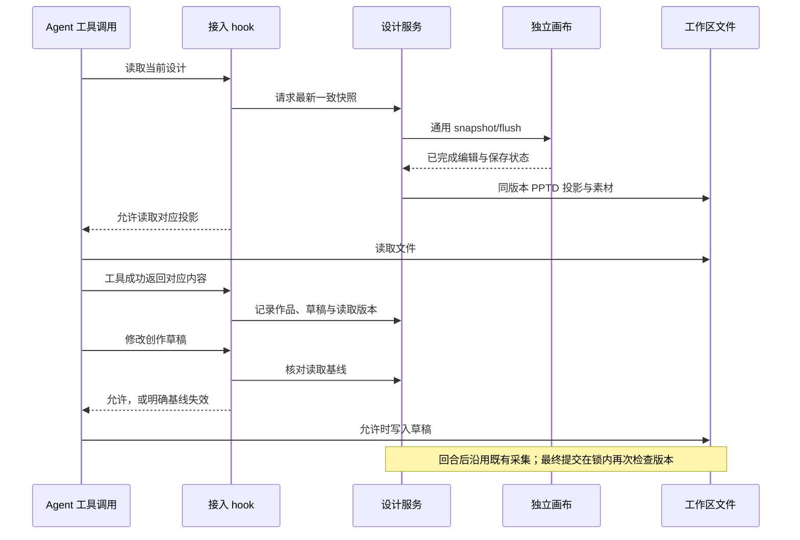

# 当前画稿按需同步与 Agent 工具 hook

Status: proposed
Translation: pending

## 摘要

手工编辑后的 BentoDoc 必须成为 Agent 可读取的最新设计上下文，否则下一轮可能依据旧 PPTD 覆盖用户修改。本方案由 Agent 的读取操作通过 hook 请求设计服务同步 PPTD，画布只提供通用快照和保存能力；写入与最终提交分别检查读取基线和当前版本。它补充 Lody 既有文件工作流，不引入新的 Agent 调度器，也不规定创作步骤。反向转换与五种 Agent 的实际 hook 接入尚待实施验证；hook 覆盖不完整时仍由 canonical 提交检查保护当前稿。

## 决策范围与来源

本记录补充并部分替代[迁移计划](2026-09-09-graphic-design-platform.zh.md)中尚未实施的 P3：新增当前画稿读取一致性，取消完整三方对比和元素/属性自动合并的迁移要求。P0–P2 的实施事实不改写；产品合同见 [Spec](../../../../specs/graphic-design-platform.zh.md)。本次只修改文档，不实现同步器、hook 或运行时 skill。

已有 [PPTD importer](../../../../packages/design-authoring/src/import.ts) 提供正向转换，不能据此认定反向转换已具备。相邻项目的 `packages/orchestration/src/job-context.ts` 可构造 Bento 上下文，也不等于已经实现 BentoDoc → PPTD。新增反向转换是确保 Agent 能读取手工编辑结果的必要成本；Lody 会话、文件、工具、权限与恢复能力继续复用。

## 文件变化预览的补充（2026-09-11）

[实时预览决策](2026-09-11-pptd-live-preview.zh.md)新增独立的文件变化 → PPTD 正向转换 → 只读预览链路，与本记录的按需反向同步并存。文件监听按实际消费者启停，复用已有正向 intake 与 Bento 渲染，不依赖五种 Agent 的 Write hook，也不提交当前稿或改写读取基线。

两条路径按来源分开：读取 hook 的输入始终是可编辑当前稿，输出是应用生成的 PPTD 投影；实时预览的输入是 Agent/外部编辑的创作草稿，输出是未提交的只读视图。投影及预览缓存不进入创作监听或产物采集，切换到预览不改变读取对象。预览不能证明创作完成，回合结束仍重新采集并执行正式校验和版本检查。首期运行中不采用预览；完成后的候选及无运行回合的外部文件采用规则见新记录。

## 职责与读取过程

| 参与者 | 责任 |
| --- | --- |
| Bento 画布 | 独立编辑、渲染、保存，提供通用 snapshot/flush；不感知 Agent 生命周期 |
| 设计服务 | 一致快照、PPTD 双向转换、素材完整性、读取基线、canonical 原子提交及冲突保留 |
| Lody 运行时和接入适配 | 既有启动、会话、工具事件和权限链；接入薄 hook/extension |
| Agent | 自主读取、调查、修改文件、使用工具、自检和完成产物 |

概念时序（P3 目标，非现有实现）：

快照必须覆盖已经完成、尚未自动保存的手工编辑，并绑定对应作品和编辑器实例。无法获取稳定快照、保存失败或转换失败时返回错误；不把旧文件当成最新信息。跨文件发布要保证 PPTD 与素材属于同一版本，避免读取半次同步。读取之后发生的新编辑由基线失效表达，不承诺模型思考期间画稿停止变化。

## 转换与文件边界

- BentoDoc 是权威当前稿；PPTD 是可读可编辑的表示。转换归属于设计能力包和服务，不由画布编辑事件触发，不给五个 Agent 各实现一套转换器。
- 先列明现有内核/编辑器支持的语义集合，再实现确定性反向转换；往返保留稳定 ID、层级与顺序、文本/形状/图片的可编辑属性、样式和素材引用。验收语义等价，不要求 YAML 字节、注释或主题别名一致；不支持的语义显式报错，不能偷偷扁平化或丢字段。
- 当前稿投影与 Agent 工作草稿分开。同步只更新投影，不能覆盖进行中的创作文件；再次读取只产生新的读取事实，不自动给旧草稿换基线。需要基于新版本继续时，由 Agent 明确重建或调整对应创作尝试。
- 基线关联作品、草稿/创作尝试、读取版本与确切内容，不使用会话级 `hasRead` 布尔值。仅收到 PreToolUse、打开路径或工具报错不代表成功读取；部分读取的有效范围也必须明确，不能自动证明已读整份设计。
- [P2 回合输入](../../../../apps/cli/src/design/turn-input.ts)的派发快照保留原事实；回合内后续成功读取可以建立新的草稿基线，但不能覆盖整个旧 manifest 或替换其他草稿的基线。
- 应用同步出来的投影具有可辨别来源，不作为 Agent 新产物进入回合后采集。具体布局、基线记录及初始化草稿方式在 P3 切片中确定，复用 workspace 和既有产物流程；不新增独立工作副本管理产品或强制逐元素编辑工具。

## hook 的强度与限制

读取前同步，成功读取后记录事实，受控写入前核对基线。写入入口包括已有设计的 Edit/Write/patch 等实际工具；不能在收到已生成的写入参数后同步并静默放行，那些参数可能仍基于旧稿。并行 read/write、跨作品操作、重试和继续都必须按同一基线合同处理，不能靠事件到达顺序推断已读。

hook 执行的是数据完整性条件，不是设计方法。它不强制 inspect → draft → self-check → review → report，不判断模型是否真正理解文件，也不要求模型必须使用某个新 `read_design` 工具。普通新文件不因设计规则被全局拦截；新建作品与基于已有画稿修改的初始化条件需明确区分。

不同 CLI 的工具事件覆盖和失败策略不同。可识别的设计读写路径接入同一同步/基线实现；不靠匹配任意 shell 文本承诺全面拦截，更不为此新建沙箱或 Agent runtime。没有 hook 的路径、超时或失效不能获得虚构的有效读取基线。最终 canonical 提交始终在现有提交锁内原子核对真实基线；缺失或过期时保留候选/错误，不自动覆盖。即使 hook 已允许草稿写入，其后仍可能发生人工编辑，因此提交检查不可省略。保护范围包含已完成但尚未落盘的画布编辑：提交前通过通用保存/快照屏障纳入版本检查，或因未保存修改而保留候选；不能只检查磁盘版本，再用提交后的重载销毁这些修改。

## 五种 Agent 的适配计划

下面记录前序静态调研识别的接入点，作为实施前重新核实的依据，**不是 Folio 当前支持或端到端验收结果**。供应商文档会变化；开工时固定实际 runtime 版本、ACP 启动方式、配置加载范围及工具事件，再记录实测矩阵。优先使用支持的会话/项目级配置，保留用户配置，不覆盖全局 hooks。

| Agent | 待接入点与来源 | 实施必须核实 |
| --- | --- | --- |
| Claude Code | [PreToolUse / PostToolUse](https://code.claude.com/docs/en/hooks#pretooluse) | Read/Edit/Write/Bash/MCP 的实际事件，拒绝与成功读取回执，ACP 下配置是否生效 |
| Codex | [工具 hooks](https://learn.chatgpt.com/docs/hooks#tool-coverage) | 实际 apply_patch、Shell/MCP 覆盖；不能假设有独立 Read 工具，交互 shell 后续输入不能从首次事件推断全覆盖 |
| Pi | [extension 的 tool_call / tool_result](https://github.com/badlogic/pi-mono/blob/main/packages/coding-agent/docs/extensions.md) | 原生与自定义工具事件、阻断结果、并行工具调用和 extension 加载方式 |
| Kimi Code | [PreToolUse / PostToolUse](https://moonshotai.github.io/kimi-code/en/customization/hooks) | 实际托管 artifact/ACP 启动是否加载；hook 错误或超时可能放行，不能视为成功校验 |
| Grok | [Grok Build hooks](https://github.com/xai-org/grok-build/blob/main/crates/codegen/xai-grok-pager/docs/user-guide/10-hooks.md) | 此处指 Grok Build CLI，非仅同名模型；固定版本的事件、阻断与错误放行语义、启动配置 |

矩阵对每种工具路径分别记录：支持读取同步、成功读取记录、阻止陈旧写入、hook 缺席/失败、最终提交保护。只有经过验证的组合才宣称支持；供应商提供 hooks 不代表本应用的托管接入已经启用。各接入只做参数/事件适配，不复制设计协议。

## 与其他范围决定的关系

P3 保留当前稿/候选查看、显式采用/丢弃、采用时再次版本检查和待处理结果重开。取消三方比较和元素级自动合并后，Agent 改标题而用户改背景也可能产生候选；两份内容保留，Agent 可在普通后续回合重新读取并修改。恢复、取消、切换 Agent 和继续沿用 Lody，不迁入上游 job/checkpoint/recovery 编排。

设计 skill 的后续改造保留格式合同、能力说明、工具参考、设计建议和可选辅助脚本；移除固定调用顺序、inspect-once、禁止自选像素分析方式及强制评审次数。`folio_*` 工具缺席仅说明该工具不可用，不表示 Agent 自带的其他能力不可用。正式 PNG/JPEG 导出继续使用固定 Bento 渲染器。本次未编辑运行时 skill，计划归 P3.6。

三个既有问题继续单列：P2.7 #2b 未改动旧 PPTD 的候选处理尚待结合新边界复核；P2-A3 本地参考图附件仍为独立切片，不自动并入 P3；reference-pack 非 PNG 能力限制待决定使用实际可用的解码能力规范化输入，或明示限制。上游 Pillow 移植的来源成立，不能仅因手写实现就断言“不必要重造”；也不继续扩写编解码器。CLI 持有字节不代表存在解码能力，Electron 宿主路径的成本须单独评估。

## 验收与未决实现细节

P3 的必要验收是手工改稿可被成功读取、往返语义一致、陈旧/缺失基线不覆盖当前稿、同步不破坏 Agent 草稿、投影不被误收集。以确定性信号覆盖并行、失败、继续及用户在读取后再次编辑；复用既有测试设施。P6 在实际安装包和上述五种接入的明确版本上验证宣称支持的路径，不以某一种通过代替全部。

尚需实施切片确定：快照/文件发布的具体接口、草稿与读取范围的身份表示、各 ACP 启动方式下的 hook 配置及未覆盖路径的能力呈现。这里确立职责与失败语义，不预先扩展会话持久 schema、通用协议或跨进程入口。该方案尚未运行产品测试、真实 Agent 或跨平台验证。

文档验证：`corepack pnpm run docs status` / `docs check` 无错误，20 条既有大小警告，无注册 SHA topic；`git diff --check` 通过。英文翻译 pending，不构成实现或发布支持证据。

提交前验证：`corepack pnpm format` 与 `corepack pnpm typecheck` 通过；静态检查中的 lint、i18n、代码协作导入和平台边界通过。公开边界检查首次指出方案中的外部 Web 实现路径，移除该路径引用后复查通过，调查结论及编排模块依据保留。已还原格式化产生的无关文件差异；沿用不运行测试的要求，未执行含测试的完整 `pnpm check`。
